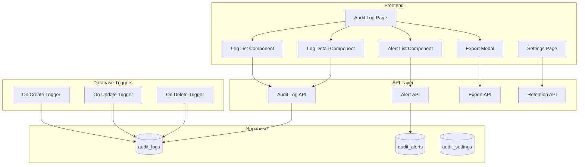

# Design Document: Audit Log

## Overview

Fitur Audit Log menyediakan sistem pencatatan dan pelacakan perubahan data yang komprehensif. Implementasi mencakup auto-logging untuk semua operasi CRUD, tracking business events, filtering dan search, export, retention management, dan security alerts. Sistem menggunakan database triggers untuk capture otomatis dan API untuk query dan management.

## Architecture



## Components and Interfaces

### 1. Audit Log API (`src/api/auditLogs.ts`)

```typescript
type EventType = 'create' | 'update' | 'delete' | 'login' | 'logout' | 'transaction' | 'refund' | 'stock_adjustment' | 'price_change' | 'role_change';
type EntityType = 'product' | 'transaction' | 'user' | 'supplier' | 'category' | 'purchase_order' | 'return' | 'discount' | 'promo' | 'outlet';

interface AuditLog {
  id: string;
  event_type: EventType;
  entity_type: EntityType;
  entity_id: string;
  user_id: string;
  user_name?: string;
  user_role?: string;
  outlet_id: string | null;
  old_values: Record<string, any> | null;
  new_values: Record<string, any> | null;
  ip_address: string | null;
  user_agent: string | null;
  summary: string;
  created_at: string;
}

interface AuditLogFilters {
  date_from?: string;
  date_to?: string;
  user_id?: string;
  entity_type?: EntityType;
  event_type?: EventType;
  entity_id?: string;
  search?: string;
}

// Functions
async function getAuditLogs(filters?: AuditLogFilters, pagination?: Pagination): Promise<PaginatedResult<AuditLog>>
async function getAuditLogById(id: string): Promise<AuditLog | null>
async function getAuditLogsByEntity(entityType: EntityType, entityId: string): Promise<AuditLog[]>
async function createAuditLog(log: CreateAuditLogInput): Promise<AuditLog>
function calculateChangedFields(oldValues: object, newValues: object): string[]
function generateSummary(eventType: EventType, entityType: EntityType, changes?: string[]): string
```

### 2. Alert API (`src/api/auditAlerts.ts`)

```typescript
type AlertSeverity = 'low' | 'medium' | 'high' | 'critical';
type AlertType = 'failed_login' | 'bulk_delete' | 'unusual_transaction' | 'unauthorized_access';

interface AuditAlert {
  id: string;
  alert_type: AlertType;
  severity: AlertSeverity;
  user_id: string | null;
  description: string;
  metadata: Record<string, any>;
  is_resolved: boolean;
  resolved_by: string | null;
  resolved_at: string | null;
  created_at: string;
}

// Functions
async function getAlerts(filters?: AlertFilters): Promise<AuditAlert[]>
async function getUnresolvedAlerts(): Promise<AuditAlert[]>
async function resolveAlert(id: string, notes?: string): Promise<AuditAlert>
async function createAlert(alert: CreateAlertInput): Promise<AuditAlert>
async function checkFailedLoginThreshold(userId: string): Promise<boolean>
async function checkBulkDeleteThreshold(userId: string, entityType: EntityType): Promise<boolean>
```

### 3. Export API (`src/api/auditExport.ts`)

```typescript
interface ExportOptions {
  format: 'csv' | 'json';
  filters: AuditLogFilters;
  columns?: string[];
}

// Functions
async function exportAuditLogs(options: ExportOptions): Promise<Blob>
function generateExportFilename(format: string): string
async function streamExportLogs(options: ExportOptions): AsyncGenerator<AuditLog>
```

### 4. Retention API (`src/api/auditRetention.ts`)

```typescript
interface RetentionSettings {
  retention_days: number;
  archive_enabled: boolean;
  archive_location: string | null;
  last_cleanup_at: string | null;
}

interface StorageStats {
  total_logs: number;
  logs_size_mb: number;
  oldest_log_date: string;
  newest_log_date: string;
}

// Functions
async function getRetentionSettings(): Promise<RetentionSettings>
async function updateRetentionSettings(settings: Partial<RetentionSettings>): Promise<RetentionSettings>
async function getStorageStats(): Promise<StorageStats>
async function runRetentionCleanup(): Promise<{ deleted: number; archived: number }>
```

### 5. Audit Logger Utility (`src/lib/auditLogger.ts`)

```typescript
interface AuditContext {
  userId: string;
  userRole: string;
  outletId?: string;
  ipAddress?: string;
  userAgent?: string;
}

// Utility class for logging from application code
class AuditLogger {
  static setContext(context: AuditContext): void
  static logCreate(entityType: EntityType, entityId: string, data: object): Promise<void>
  static logUpdate(entityType: EntityType, entityId: string, oldData: object, newData: object): Promise<void>
  static logDelete(entityType: EntityType, entityId: string, data: object): Promise<void>
  static logEvent(eventType: EventType, entityType: EntityType, entityId: string, metadata?: object): Promise<void>
}
```

### 6. UI Components

```typescript
// Log List Component
interface LogListProps {
  filters: AuditLogFilters;
  onFilterChange: (filters: AuditLogFilters) => void;
  onSelectLog: (log: AuditLog) => void;
}

// Log Detail Component
interface LogDetailProps {
  log: AuditLog;
  onClose: () => void;
}

// Alert List Component
interface AlertListProps {
  onResolve: (alertId: string) => void;
}

// Export Modal Component
interface ExportModalProps {
  isOpen: boolean;
  filters: AuditLogFilters;
  onExport: (options: ExportOptions) => void;
  onClose: () => void;
}

// Retention Settings Component
interface RetentionSettingsProps {
  onSave: (settings: RetentionSettings) => void;
}
```

## Data Models

### Database Schema

```sql
-- Audit Logs table
CREATE TABLE IF NOT EXISTS public.audit_logs (
    id UUID DEFAULT gen_random_uuid() PRIMARY KEY,
    event_type TEXT NOT NULL,
    entity_type TEXT NOT NULL,
    entity_id UUID,
    user_id UUID REFERENCES auth.users(id),
    outlet_id UUID REFERENCES public.outlets(id),
    old_values JSONB,
    new_values JSONB,
    changed_fields TEXT[],
    ip_address TEXT,
    user_agent TEXT,
    summary TEXT,
    created_at TIMESTAMP WITH TIME ZONE DEFAULT NOW()
);

-- Audit Alerts table
CREATE TABLE IF NOT EXISTS public.audit_alerts (
    id UUID DEFAULT gen_random_uuid() PRIMARY KEY,
    alert_type TEXT NOT NULL,
    severity TEXT NOT NULL CHECK (severity IN ('low', 'medium', 'high', 'critical')),
    user_id UUID REFERENCES auth.users(id),
    description TEXT NOT NULL,
    metadata JSONB,
    is_resolved BOOLEAN DEFAULT false,
    resolved_by UUID REFERENCES auth.users(id),
    resolved_at TIMESTAMP WITH TIME ZONE,
    resolution_notes TEXT,
    created_at TIMESTAMP WITH TIME ZONE DEFAULT NOW()
);

-- Audit Settings table
CREATE TABLE IF NOT EXISTS public.audit_settings (
    id UUID DEFAULT gen_random_uuid() PRIMARY KEY,
    retention_days INTEGER NOT NULL DEFAULT 90,
    archive_enabled BOOLEAN DEFAULT false,
    archive_location TEXT,
    last_cleanup_at TIMESTAMP WITH TIME ZONE,
    created_at TIMESTAMP WITH TIME ZONE DEFAULT NOW(),
    updated_at TIMESTAMP WITH TIME ZONE DEFAULT NOW()
);

-- Indexes for performance
CREATE INDEX IF NOT EXISTS idx_audit_logs_created_at ON public.audit_logs(created_at DESC);
CREATE INDEX IF NOT EXISTS idx_audit_logs_entity ON public.audit_logs(entity_type, entity_id);
CREATE INDEX IF NOT EXISTS idx_audit_logs_user ON public.audit_logs(user_id);
CREATE INDEX IF NOT EXISTS idx_audit_logs_event_type ON public.audit_logs(event_type);

-- RLS Policies (only admins can view audit logs)
ALTER TABLE public.audit_logs ENABLE ROW LEVEL SECURITY;
ALTER TABLE public.audit_alerts ENABLE ROW LEVEL SECURITY;
ALTER TABLE public.audit_settings ENABLE ROW LEVEL SECURITY;

CREATE POLICY "Only admins can view audit logs" ON public.audit_logs
    FOR SELECT USING (
        EXISTS (
            SELECT 1 FROM public.user_profiles
            WHERE id = auth.uid() AND role = 'admin'
        )
    );

CREATE POLICY "Only admins can manage alerts" ON public.audit_alerts
    FOR ALL USING (
        EXISTS (
            SELECT 1 FROM public.user_profiles
            WHERE id = auth.uid() AND role = 'admin'
        )
    );

-- Function to create audit log
CREATE OR REPLACE FUNCTION create_audit_log(
    p_event_type TEXT,
    p_entity_type TEXT,
    p_entity_id UUID,
    p_old_values JSONB,
    p_new_values JSONB,
    p_summary TEXT
) RETURNS UUID AS $$
DECLARE
    v_log_id UUID;
BEGIN
    INSERT INTO public.audit_logs (
        event_type, entity_type, entity_id, user_id, old_values, new_values, summary
    ) VALUES (
        p_event_type, p_entity_type, p_entity_id, auth.uid(), p_old_values, p_new_values, p_summary
    ) RETURNING id INTO v_log_id;
    
    RETURN v_log_id;
END;
$$ LANGUAGE plpgsql SECURITY DEFINER;
```

### TypeScript Interfaces

```typescript
export type AuditEventType = 'create' | 'update' | 'delete' | 'login' | 'logout' | 'transaction' | 'refund' | 'stock_adjustment' | 'price_change' | 'role_change';
export type AuditEntityType = 'product' | 'transaction' | 'user' | 'supplier' | 'category' | 'purchase_order' | 'return' | 'discount' | 'promo' | 'outlet';
export type AlertSeverity = 'low' | 'medium' | 'high' | 'critical';
export type AlertType = 'failed_login' | 'bulk_delete' | 'unusual_transaction' | 'unauthorized_access';

export interface AuditLog {
  id: string;
  event_type: AuditEventType;
  entity_type: AuditEntityType;
  entity_id: string | null;
  user_id: string | null;
  user?: User;
  outlet_id: string | null;
  old_values: Record<string, any> | null;
  new_values: Record<string, any> | null;
  changed_fields: string[] | null;
  ip_address: string | null;
  user_agent: string | null;
  summary: string | null;
  created_at: string;
}

export interface AuditAlert {
  id: string;
  alert_type: AlertType;
  severity: AlertSeverity;
  user_id: string | null;
  user?: User;
  description: string;
  metadata: Record<string, any> | null;
  is_resolved: boolean;
  resolved_by: string | null;
  resolved_at: string | null;
  resolution_notes: string | null;
  created_at: string;
}

export interface AuditSettings {
  id: string;
  retention_days: number;
  archive_enabled: boolean;
  archive_location: string | null;
  last_cleanup_at: string | null;
  created_at: string;
  updated_at: string;
}
```

## Correctness Properties

*A property is a characteristic or behavior that should hold true across all valid executions of a system-essentially, a formal statement about what the system should do. Properties serve as the bridge between human-readable specifications and machine-verifiable correctness guarantees.*

### Property 1: CRUD Event Logging

*For any* create, update, or delete operation on tracked entities: a log entry should be created with correct event_type, entity_type, entity_id, user_id, and timestamp. For updates, old_values and new_values should be recorded. For deletes, old_values should contain the deleted data snapshot.

**Validates: Requirements 1.1, 1.2, 1.3**

### Property 2: Metadata Capture

*For any* audit log entry, it should include ip_address and user_agent when available, AND outlet_id when the operation is performed in an outlet context.

**Validates: Requirements 1.4, 1.5**

### Property 3: Business Event Logging

*For any* business event (transaction, refund, stock_adjustment, price_change, role_change), a corresponding audit log should be created with the appropriate event_type and relevant metadata.

**Validates: Requirements 2.1, 2.2, 2.3, 2.4, 2.5**

### Property 4: Log Filtering Accuracy

*For any* filter applied to audit logs: date range filter should return only logs within the range, user filter should return only logs by that user, entity_type filter should return only logs for that entity, AND event_type filter should return only logs of that type.

**Validates: Requirements 3.2, 3.3, 3.4, 3.5**

### Property 5: Changed Fields Detection

*For any* update event, the changed_fields array should contain exactly the fields where old_values differs from new_values.

**Validates: Requirements 4.2**

### Property 6: Export Content Accuracy

*For any* export operation, the exported data should match the applied filters, include all specified columns, AND the filename should contain a timestamp.

**Validates: Requirements 5.1, 5.2, 5.3**

### Property 7: Retention Cleanup

*For any* retention cleanup operation, logs older than retention_days should be deleted or archived, AND logs within retention period should remain unchanged.

**Validates: Requirements 6.1, 6.2**

### Property 8: Suspicious Activity Detection

*For any* user with more than N failed login attempts within a time window, a 'failed_login' alert should be created. *For any* user who deletes more than M records of the same entity type within a time window, a 'bulk_delete' alert should be created.

**Validates: Requirements 7.1, 7.2**

### Property 9: Alert Severity Assignment

*For any* created alert, it should have a severity level (low, medium, high, critical) based on the alert type and context.

**Validates: Requirements 7.4**

## Error Handling

| Error Scenario | Handling Strategy |
|----------------|-------------------|
| Audit log creation fails | Log to console, don't block main operation |
| Large export request | Use streaming/pagination, show progress |
| Retention cleanup fails | Log error, retry on next scheduled run |
| Alert creation fails | Log to console, don't block main operation |
| Invalid filter parameters | Display validation error, use defaults |
| Database connection error | Display error toast, allow retry |

## Testing Strategy

### Property-Based Testing

Library: **fast-check** (untuk TypeScript/JavaScript)

Property-based tests akan digunakan untuk memverifikasi correctness properties:

1. **CRUD Logging Test**: Perform CRUD operations, verify logs created
2. **Metadata Test**: Create logs with context, verify metadata captured
3. **Business Event Test**: Trigger business events, verify logs created
4. **Filter Test**: Apply various filters, verify results match
5. **Changed Fields Test**: Update data, verify changed fields detected
6. **Export Test**: Export with filters, verify content matches
7. **Retention Test**: Create old logs, run cleanup, verify deletion
8. **Suspicious Activity Test**: Simulate suspicious patterns, verify alerts
9. **Severity Test**: Create alerts, verify severity assigned

Setiap property test akan dikonfigurasi untuk menjalankan minimal 100 iterasi.

Format tag untuk property tests:
```typescript
// **Feature: audit-log, Property 1: CRUD Event Logging**
```

### Unit Tests

Unit tests akan mencakup:
- Changed fields calculation
- Summary generation
- Export filename format
- Alert threshold checking
