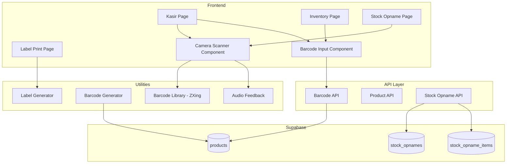

# Design Document: Barcode Scanner

## Overview

Fitur Barcode Scanner menyediakan kemampuan pemindaian barcode untuk mempercepat proses checkout dan pengelolaan inventory. Implementasi mencakup scanner kamera menggunakan library QuaggaJS/ZXing, dukungan scanner eksternal via keyboard input, manajemen barcode produk, stock opname dengan barcode, dan pencetakan label barcode.

## Architecture



## Components and Interfaces

### 1. Barcode API (`src/api/barcodes.ts`)

```typescript
interface BarcodeValidation {
  isValid: boolean;
  format: string | null;
  error?: string;
}

interface ProductLookupResult {
  found: boolean;
  product?: Product;
  error?: string;
}

// Functions
function validateBarcodeFormat(barcode: string): BarcodeValidation
function generateInternalBarcode(storePrefix: string): string
async function lookupProductByBarcode(barcode: string): Promise<ProductLookupResult>
async function assignBarcodeToProduct(productId: string, barcode: string): Promise<void>
async function checkBarcodeUniqueness(barcode: string, excludeProductId?: string): Promise<boolean>
```

### 2. Stock Opname API (`src/api/stockOpname.ts`)

```typescript
interface CreateOpnameInput {
  outlet_id?: string;
  notes?: string;
}

interface OpnameItem {
  product_id: string;
  system_stock: number;
  actual_stock: number;
  discrepancy: number;
}

interface StockOpname {
  id: string;
  opname_number: string;
  outlet_id: string | null;
  status: 'in_progress' | 'completed' | 'cancelled';
  items: OpnameItem[];
  notes: string | null;
  created_by: string;
  completed_at: string | null;
  created_at: string;
}

// Functions
async function createStockOpname(input: CreateOpnameInput): Promise<StockOpname>
async function getStockOpnames(filters?: OpnameFilters): Promise<StockOpname[]>
async function getStockOpnameById(id: string): Promise<StockOpname | null>
async function addOpnameItem(opnameId: string, productId: string, actualStock: number): Promise<OpnameItem>
async function updateOpnameItem(itemId: string, actualStock: number): Promise<OpnameItem>
async function completeStockOpname(id: string): Promise<StockOpname>
async function cancelStockOpname(id: string): Promise<StockOpname>
```

### 3. Label Generator (`src/lib/labelGenerator.ts`)

```typescript
interface LabelData {
  barcode: string;
  productName: string;
  price: number;
  size: '38x25' | '50x30';
}

interface LabelBatch {
  products: Array<{
    productId: string;
    quantity: number;
  }>;
  size: '38x25' | '50x30';
}

// Functions
function generateLabelSVG(data: LabelData): string
function generateLabelPDF(batch: LabelBatch): Blob
function printLabels(batch: LabelBatch): void
```

### 4. Barcode Utilities (`src/lib/barcodeUtils.ts`)

```typescript
type BarcodeFormat = 'EAN13' | 'EAN8' | 'UPCA' | 'CODE128' | 'INTERNAL';

// Functions
function detectBarcodeFormat(barcode: string): BarcodeFormat | null
function isValidEAN13(barcode: string): boolean
function isValidEAN8(barcode: string): boolean
function isValidUPCA(barcode: string): boolean
function isValidCode128(barcode: string): boolean
function calculateCheckDigit(barcode: string, format: BarcodeFormat): string
function generateInternalBarcode(prefix: string): string
```

### 5. UI Components

```typescript
// Camera Scanner Component
interface CameraScannerProps {
  onScan: (barcode: string) => void;
  onError: (error: string) => void;
  isActive: boolean;
  continuous?: boolean; // For stock opname mode
}

// Barcode Input Component (for external scanner)
interface BarcodeInputProps {
  onSubmit: (barcode: string) => void;
  autoFocus?: boolean;
  placeholder?: string;
}

// Scan Result Toast
interface ScanResultProps {
  type: 'success' | 'error' | 'warning';
  message: string;
  product?: Product;
}

// Stock Opname Scanner
interface StockOpnameScannerProps {
  opnameId: string;
  onItemScanned: (item: OpnameItem) => void;
}

// Label Print Preview
interface LabelPrintPreviewProps {
  products: Product[];
  size: '38x25' | '50x30';
  onPrint: () => void;
}
```

## Data Models

### Database Schema

```sql
-- Add barcode column to products if not exists
ALTER TABLE public.products ADD COLUMN IF NOT EXISTS barcode TEXT UNIQUE;

-- Stock Opnames table
CREATE TABLE IF NOT EXISTS public.stock_opnames (
    id UUID DEFAULT gen_random_uuid() PRIMARY KEY,
    opname_number TEXT NOT NULL UNIQUE,
    outlet_id UUID REFERENCES public.outlets(id),
    status TEXT DEFAULT 'in_progress' CHECK (status IN ('in_progress', 'completed', 'cancelled')),
    notes TEXT,
    created_by UUID REFERENCES auth.users(id),
    completed_at TIMESTAMP WITH TIME ZONE,
    created_at TIMESTAMP WITH TIME ZONE DEFAULT NOW(),
    updated_at TIMESTAMP WITH TIME ZONE DEFAULT NOW()
);

-- Stock Opname Items table
CREATE TABLE IF NOT EXISTS public.stock_opname_items (
    id UUID DEFAULT gen_random_uuid() PRIMARY KEY,
    opname_id UUID REFERENCES public.stock_opnames(id) ON DELETE CASCADE,
    product_id UUID REFERENCES public.products(id),
    system_stock INTEGER NOT NULL,
    actual_stock INTEGER NOT NULL,
    discrepancy INTEGER GENERATED ALWAYS AS (actual_stock - system_stock) STORED,
    scanned_at TIMESTAMP WITH TIME ZONE DEFAULT NOW(),
    UNIQUE(opname_id, product_id)
);

-- Stock Adjustments table (for opname results)
CREATE TABLE IF NOT EXISTS public.stock_adjustments (
    id UUID DEFAULT gen_random_uuid() PRIMARY KEY,
    opname_id UUID REFERENCES public.stock_opnames(id),
    product_id UUID REFERENCES public.products(id),
    previous_stock INTEGER NOT NULL,
    new_stock INTEGER NOT NULL,
    adjustment INTEGER NOT NULL,
    reason TEXT DEFAULT 'stock_opname',
    created_at TIMESTAMP WITH TIME ZONE DEFAULT NOW()
);

-- RLS Policies
ALTER TABLE public.stock_opnames ENABLE ROW LEVEL SECURITY;
ALTER TABLE public.stock_opname_items ENABLE ROW LEVEL SECURITY;
ALTER TABLE public.stock_adjustments ENABLE ROW LEVEL SECURITY;

CREATE POLICY "Authenticated users can view stock opnames" ON public.stock_opnames
    FOR SELECT USING (auth.role() = 'authenticated');

CREATE POLICY "Managers and admins can manage stock opnames" ON public.stock_opnames
    FOR ALL USING (
        EXISTS (
            SELECT 1 FROM public.user_profiles
            WHERE id = auth.uid() AND role IN ('admin', 'manager')
        )
    );
```

### TypeScript Interfaces

```typescript
export interface StockOpname {
  id: string;
  opname_number: string;
  outlet_id: string | null;
  status: 'in_progress' | 'completed' | 'cancelled';
  notes: string | null;
  created_by: string;
  completed_at: string | null;
  created_at: string;
  updated_at: string;
  items?: StockOpnameItem[];
}

export interface StockOpnameItem {
  id: string;
  opname_id: string;
  product_id: string;
  product?: Product;
  system_stock: number;
  actual_stock: number;
  discrepancy: number;
  scanned_at: string;
}

export interface StockAdjustment {
  id: string;
  opname_id: string | null;
  product_id: string;
  previous_stock: number;
  new_stock: number;
  adjustment: number;
  reason: string;
  created_at: string;
}
```

## Correctness Properties

*A property is a characteristic or behavior that should hold true across all valid executions of a system-essentially, a formal statement about what the system should do. Properties serve as the bridge between human-readable specifications and machine-verifiable correctness guarantees.*

### Property 1: Cart Addition on Barcode Scan

*For any* valid product barcode scanned, the product should be added to cart with quantity 1 if not already in cart, OR the existing cart item quantity should be incremented by 1 if already in cart.

**Validates: Requirements 1.3, 1.4**

### Property 2: Barcode Format Support

*For any* barcode string in EAN-13, EAN-8, UPC-A, or Code 128 format, the system should correctly identify and validate the format.

**Validates: Requirements 2.3**

### Property 3: Barcode Uniqueness Validation

*For any* barcode assignment to a product, the system should reject the assignment if another product already has the same barcode.

**Validates: Requirements 3.2**

### Property 4: Barcode Format Validation

*For any* barcode string that does not match any supported format (EAN-13, EAN-8, UPC-A, Code 128, or internal format), the system should reject it with a validation error.

**Validates: Requirements 3.3**

### Property 5: Internal Barcode Generation

*For any* generated internal barcode, it should start with the configured store prefix AND be unique across all products.

**Validates: Requirements 3.4, 3.5**

### Property 6: Unknown Barcode Handling

*For any* barcode that does not match any product in the database, the lookup should return a "not found" result.

**Validates: Requirements 4.2**

### Property 7: Out of Stock Prevention

*For any* product with zero stock, attempting to add it to cart via barcode scan should be rejected with a stock warning.

**Validates: Requirements 4.3**

### Property 8: Stock Opname Discrepancy Calculation

*For any* stock opname item, the discrepancy should equal (actual_stock - system_stock).

**Validates: Requirements 5.3**

### Property 9: Stock Opname Completion

*For any* completed stock opname, the product stock quantities should be updated to match actual_stock values, AND stock_adjustment records should be created for each item with discrepancy != 0.

**Validates: Requirements 5.4**

### Property 10: Label Generation Content

*For any* generated barcode label, it should contain the barcode value, product name, and price.

**Validates: Requirements 6.1, 6.2**

## Error Handling

| Error Scenario | Handling Strategy |
|----------------|-------------------|
| Camera access denied | Display message to enable camera permission |
| Barcode not recognized | Display "Format barcode tidak dikenali" |
| Product not found | Display "Produk tidak ditemukan" with manual entry option |
| Product out of stock | Display "Stok habis" warning, prevent cart addition |
| Duplicate barcode | Display "Barcode sudah digunakan produk lain" |
| Scanner initialization failed | Fall back to manual barcode input |
| Label print failed | Display error, allow retry |

## Testing Strategy

### Property-Based Testing

Library: **fast-check** (untuk TypeScript/JavaScript)

Property-based tests akan digunakan untuk memverifikasi correctness properties:

1. **Cart Addition Test**: Scan barcodes, verify cart behavior
2. **Format Support Test**: Generate various format barcodes, verify detection
3. **Uniqueness Test**: Try duplicate barcodes, verify rejection
4. **Format Validation Test**: Generate invalid barcodes, verify rejection
5. **Internal Barcode Test**: Generate internal barcodes, verify format and uniqueness
6. **Unknown Barcode Test**: Lookup non-existent barcodes, verify not found
7. **Out of Stock Test**: Scan zero-stock products, verify rejection
8. **Discrepancy Test**: Create opname items, verify calculation
9. **Opname Completion Test**: Complete opname, verify stock updates
10. **Label Content Test**: Generate labels, verify content

Setiap property test akan dikonfigurasi untuk menjalankan minimal 100 iterasi.

Format tag untuk property tests:
```typescript
// **Feature: barcode-scanner, Property 1: Cart Addition on Barcode Scan**
```

### Unit Tests

Unit tests akan mencakup:
- EAN-13 check digit calculation
- Barcode format detection
- Internal barcode prefix validation
- Discrepancy calculation
