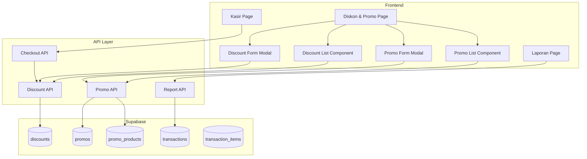

# Design Document: Diskon & Promo

## Overview

Fitur Diskon & Promo menyediakan sistem lengkap untuk mengelola diskon produk dan kampanye promosi. Implementasi mencakup diskon per produk (persentase/nominal), promo dengan periode aktif, auto-apply saat checkout, dan laporan performa diskon. Sistem terintegrasi dengan modul kasir untuk penerapan diskon otomatis.

## Architecture



## Components and Interfaces

### 1. Discount API (`src/api/discounts.ts`)

```typescript
type DiscountType = 'percentage' | 'nominal';

interface CreateDiscountInput {
  product_id: string;
  discount_type: DiscountType;
  discount_value: number;
}

interface UpdateDiscountInput {
  discount_type?: DiscountType;
  discount_value?: number;
  is_active?: boolean;
}

// Functions
async function createDiscount(input: CreateDiscountInput): Promise<Discount>
async function getDiscounts(filters?: DiscountFilters): Promise<Discount[]>
async function getDiscountById(id: string): Promise<Discount | null>
async function getActiveDiscountByProductId(productId: string): Promise<Discount | null>
async function updateDiscount(id: string, input: UpdateDiscountInput): Promise<Discount>
async function deactivateDiscount(id: string): Promise<Discount>
async function deleteDiscount(id: string): Promise<void>
```

### 2. Promo API (`src/api/promos.ts`)

```typescript
interface CreatePromoInput {
  name: string;
  description?: string;
  start_date: string;
  end_date: string;
  discount_type: DiscountType;
  discount_value: number;
  min_purchase?: number;
  product_ids: string[];
}

interface UpdatePromoInput {
  name?: string;
  description?: string;
  start_date?: string;
  end_date?: string;
  discount_type?: DiscountType;
  discount_value?: number;
  min_purchase?: number;
  is_active?: boolean;
}

// Functions
async function createPromo(input: CreatePromoInput): Promise<Promo>
async function getPromos(filters?: PromoFilters): Promise<Promo[]>
async function getPromoById(id: string): Promise<Promo | null>
async function getActivePromos(): Promise<Promo[]>
async function updatePromo(id: string, input: UpdatePromoInput): Promise<Promo>
async function addProductsToPromo(promoId: string, productIds: string[]): Promise<void>
async function removeProductFromPromo(promoId: string, productId: string): Promise<void>
async function deletePromo(id: string): Promise<void>
```

### 3. Discount Calculation Utilities (`src/lib/discountCalculation.ts`)

```typescript
interface DiscountedPrice {
  originalPrice: number;
  discountAmount: number;
  finalPrice: number;
  discountType: DiscountType;
  discountValue: number;
}

// Functions
function calculatePercentageDiscount(price: number, percentage: number): DiscountedPrice
function calculateNominalDiscount(price: number, nominal: number): DiscountedPrice
function calculateDiscountedPrice(price: number, discount: Discount): DiscountedPrice
function getApplicableDiscount(productId: string, discounts: Discount[], promos: Promo[]): Discount | null
function calculateCartWithDiscounts(items: CartItem[], discounts: Discount[], promos: Promo[]): CartWithDiscounts
function checkMinimumPurchase(cartTotal: number, promo: Promo): { eligible: boolean; remaining: number }
```

### 4. Discount Report API (`src/api/discountReports.ts`)

```typescript
interface DiscountReportSummary {
  totalSalesWithDiscount: number;
  totalDiscountAmount: number;
  transactionCount: number;
  averageDiscountPerTransaction: number;
}

interface PromoPerformance {
  promoId: string;
  promoName: string;
  salesDuringPromo: number;
  discountGiven: number;
  transactionCount: number;
}

// Functions
async function getDiscountReportSummary(dateRange: DateRange): Promise<DiscountReportSummary>
async function getPromoPerformance(promoId: string): Promise<PromoPerformance>
async function getDiscountedTransactions(filters: ReportFilters): Promise<Transaction[]>
```

### 5. UI Components

```typescript
// Discount List Component
interface DiscountListProps {
  onSelect: (discount: Discount) => void;
  onCreateNew: () => void;
}

// Promo List Component
interface PromoListProps {
  onSelect: (promo: Promo) => void;
  onCreateNew: () => void;
}

// Discount Form Modal
interface DiscountFormProps {
  isOpen: boolean;
  discount?: Discount;
  onSave: (discount: Discount) => void;
  onClose: () => void;
}

// Promo Form Modal
interface PromoFormProps {
  isOpen: boolean;
  promo?: Promo;
  onSave: (promo: Promo) => void;
  onClose: () => void;
}
```

## Data Models

### Database Schema

```sql
-- Discounts table (for individual product discounts)
CREATE TABLE IF NOT EXISTS public.discounts (
    id UUID DEFAULT gen_random_uuid() PRIMARY KEY,
    product_id UUID REFERENCES public.products(id) ON DELETE CASCADE,
    discount_type TEXT NOT NULL CHECK (discount_type IN ('percentage', 'nominal')),
    discount_value NUMERIC(12, 2) NOT NULL,
    is_active BOOLEAN DEFAULT true,
    created_at TIMESTAMP WITH TIME ZONE DEFAULT NOW(),
    updated_at TIMESTAMP WITH TIME ZONE DEFAULT NOW(),
    UNIQUE(product_id) -- Only one active discount per product
);

-- Promos table (for promotional campaigns)
CREATE TABLE IF NOT EXISTS public.promos (
    id UUID DEFAULT gen_random_uuid() PRIMARY KEY,
    name TEXT NOT NULL,
    description TEXT,
    start_date TIMESTAMP WITH TIME ZONE NOT NULL,
    end_date TIMESTAMP WITH TIME ZONE NOT NULL,
    discount_type TEXT NOT NULL CHECK (discount_type IN ('percentage', 'nominal')),
    discount_value NUMERIC(12, 2) NOT NULL,
    min_purchase NUMERIC(12, 2),
    is_active BOOLEAN DEFAULT true,
    created_at TIMESTAMP WITH TIME ZONE DEFAULT NOW(),
    updated_at TIMESTAMP WITH TIME ZONE DEFAULT NOW(),
    CONSTRAINT valid_date_range CHECK (end_date > start_date)
);

-- Promo Products junction table
CREATE TABLE IF NOT EXISTS public.promo_products (
    id UUID DEFAULT gen_random_uuid() PRIMARY KEY,
    promo_id UUID REFERENCES public.promos(id) ON DELETE CASCADE,
    product_id UUID REFERENCES public.products(id) ON DELETE CASCADE,
    created_at TIMESTAMP WITH TIME ZONE DEFAULT NOW(),
    UNIQUE(promo_id, product_id)
);

-- Add discount columns to transaction_items
ALTER TABLE public.transaction_items ADD COLUMN IF NOT EXISTS original_price NUMERIC(12, 2);
ALTER TABLE public.transaction_items ADD COLUMN IF NOT EXISTS discount_amount NUMERIC(12, 2) DEFAULT 0;
ALTER TABLE public.transaction_items ADD COLUMN IF NOT EXISTS discount_id UUID REFERENCES public.discounts(id);
ALTER TABLE public.transaction_items ADD COLUMN IF NOT EXISTS promo_id UUID REFERENCES public.promos(id);

-- RLS Policies
ALTER TABLE public.discounts ENABLE ROW LEVEL SECURITY;
ALTER TABLE public.promos ENABLE ROW LEVEL SECURITY;
ALTER TABLE public.promo_products ENABLE ROW LEVEL SECURITY;

CREATE POLICY "Authenticated users can view discounts" ON public.discounts
    FOR SELECT USING (auth.role() = 'authenticated');

CREATE POLICY "Managers and admins can manage discounts" ON public.discounts
    FOR ALL USING (
        EXISTS (
            SELECT 1 FROM public.user_profiles
            WHERE id = auth.uid() AND role IN ('admin', 'manager')
        )
    );

CREATE POLICY "Authenticated users can view promos" ON public.promos
    FOR SELECT USING (auth.role() = 'authenticated');

CREATE POLICY "Managers and admins can manage promos" ON public.promos
    FOR ALL USING (
        EXISTS (
            SELECT 1 FROM public.user_profiles
            WHERE id = auth.uid() AND role IN ('admin', 'manager')
        )
    );
```

### TypeScript Interfaces

```typescript
export interface Discount {
  id: string;
  product_id: string;
  product_name?: string; // Joined from products
  discount_type: 'percentage' | 'nominal';
  discount_value: number;
  is_active: boolean;
  created_at: string;
  updated_at: string;
}

export interface Promo {
  id: string;
  name: string;
  description: string | null;
  start_date: string;
  end_date: string;
  discount_type: 'percentage' | 'nominal';
  discount_value: number;
  min_purchase: number | null;
  is_active: boolean;
  product_count?: number;
  products?: Product[];
  created_at: string;
  updated_at: string;
}

export interface PromoProduct {
  id: string;
  promo_id: string;
  product_id: string;
  created_at: string;
}
```

## Correctness Properties

*A property is a characteristic or behavior that should hold true across all valid executions of a system-essentially, a formal statement about what the system should do. Properties serve as the bridge between human-readable specifications and machine-verifiable correctness guarantees.*

### Property 1: Discount Creation Data Persistence

*For any* valid discount creation input (valid product_id, valid discount_type, valid discount_value), creating a discount and then retrieving it should return all stored fields with matching values, and is_active should default to true.

**Validates: Requirements 1.1, 1.4**

### Property 2: Percentage Discount Validation

*For any* percentage discount value, the system should accept values between 1 and 100 (inclusive), AND reject values outside this range.

**Validates: Requirements 1.2**

### Property 3: Nominal Discount Validation

*For any* nominal discount value and product price, the system should accept values greater than 0 AND less than the product price, AND reject values outside this range.

**Validates: Requirements 1.3**

### Property 4: Discount Uniqueness Per Product

*For any* product with an existing active discount, attempting to create another discount for the same product should fail.

**Validates: Requirements 1.5**

### Property 5: Promo Creation and Date Validation

*For any* promo creation input, the system should store all fields correctly, AND reject promos where end_date is not after start_date.

**Validates: Requirements 2.1, 2.2**

### Property 6: Promo Period Activation

*For any* promo, when current date is within the promo period (start_date <= now <= end_date), the promo should be considered active, AND when current date is outside the period, the promo should be considered inactive.

**Validates: Requirements 2.4, 2.5**

### Property 7: Discount Calculation Accuracy

*For any* product price and discount: (1) percentage discount should calculate final_price = price × (1 - percentage/100), (2) nominal discount should calculate final_price = price - nominal_value, AND discount_amount should equal price - final_price.

**Validates: Requirements 4.3, 4.4**

### Property 8: Cart Total with Discounts

*For any* cart with discounted items, the cart total should equal the sum of (quantity × discounted_price) for all items, where discounted_price applies active discounts.

**Validates: Requirements 4.2**

### Property 9: Minimum Purchase Requirement

*For any* promo with minimum purchase requirement and cart total: if cart_total < min_purchase, the promo discount should NOT be applied, AND if cart_total >= min_purchase, the promo discount should be applied.

**Validates: Requirements 6.2, 6.3**

### Property 10: Remaining Amount Calculation

*For any* promo with minimum purchase and cart total below minimum, the remaining amount should equal min_purchase - cart_total.

**Validates: Requirements 6.4**

### Property 11: Discount Report Accuracy

*For any* date range, the discount report should show total_sales_with_discount equal to sum of transaction totals with discounts, AND total_discount_amount equal to sum of all discount_amounts in transaction_items.

**Validates: Requirements 5.1, 5.2**

## Error Handling

| Error Scenario | Handling Strategy |
|----------------|-------------------|
| Invalid percentage (not 1-100) | Display validation error "Persentase harus antara 1-100" |
| Invalid nominal (>= product price) | Display validation error "Diskon tidak boleh melebihi harga produk" |
| Duplicate product discount | Display error "Produk sudah memiliki diskon aktif" |
| Invalid promo dates | Display error "Tanggal berakhir harus setelah tanggal mulai" |
| Promo without products | Display error "Pilih minimal satu produk untuk promo" |
| Database error | Display error toast, allow retry |

## Testing Strategy

### Property-Based Testing

Library: **fast-check** (untuk TypeScript/JavaScript)

Property-based tests akan digunakan untuk memverifikasi correctness properties:

1. **Discount Creation Test**: Generate random valid inputs, verify persistence
2. **Percentage Validation Test**: Generate random percentages, verify range validation
3. **Nominal Validation Test**: Generate random nominals and prices, verify validation
4. **Uniqueness Test**: Try duplicate discounts, verify rejection
5. **Promo Creation Test**: Generate random promos, verify persistence and date validation
6. **Period Activation Test**: Generate dates, verify activation logic
7. **Calculation Test**: Generate prices and discounts, verify formulas
8. **Cart Total Test**: Generate carts with discounts, verify totals
9. **Minimum Purchase Test**: Generate carts and promos, verify eligibility
10. **Remaining Amount Test**: Generate below-minimum carts, verify calculation
11. **Report Test**: Generate transactions, verify aggregations

Setiap property test akan dikonfigurasi untuk menjalankan minimal 100 iterasi.

Format tag untuk property tests:
```typescript
// **Feature: diskon-promo, Property 7: Discount Calculation Accuracy**
```

### Unit Tests

Unit tests akan mencakup:
- Discount type validation
- Date range validation
- Price calculation edge cases
- Cart total calculation
