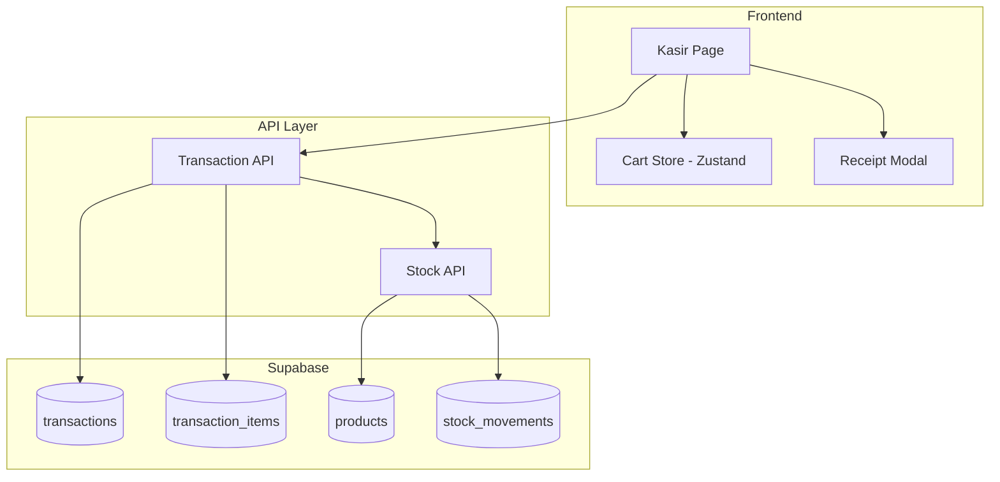

# Design Document: Kasir Checkout

## Overview

Fitur Kasir Checkout menyempurnakan halaman Kasir yang sudah ada dengan menambahkan kemampuan untuk menyimpan transaksi ke database Supabase, mengurangi stok produk secara otomatis, dan mencetak struk transaksi. Implementasi ini menggunakan arsitektur yang sudah ada dengan menambahkan API layer untuk transaksi dan komponen modal untuk struk.

## Architecture



## Components and Interfaces

### 1. Transaction API (`src/api/transactions.ts`)

```typescript
interface CreateTransactionInput {
  items: CartItem[];
  paymentMethod: 'cash' | 'card' | 'e-wallet';
  cashReceived?: number;
  discountAmount: number;
  taxAmount: number;
}

interface TransactionResult {
  transaction: Transaction;
  transactionItems: TransactionItem[];
}

// Functions
async function generateTransactionNumber(): Promise<string>
async function createTransaction(input: CreateTransactionInput): Promise<TransactionResult>
async function getTransactionById(id: string): Promise<Transaction | null>
```

### 2. Stock API (`src/api/stock.ts`)

```typescript
interface StockUpdateInput {
  productId: string;
  quantity: number;
  movementType: 'in' | 'out' | 'adjustment';
  referenceType?: string;
  referenceId?: string;
  notes?: string;
}

// Functions
async function updateStock(input: StockUpdateInput): Promise<void>
async function bulkUpdateStock(inputs: StockUpdateInput[]): Promise<void>
async function validateStockAvailability(items: CartItem[]): Promise<{valid: boolean; errors: string[]}>
```

### 3. Receipt Modal Component (`src/components/kasir/ReceiptModal.tsx`)

```typescript
interface ReceiptModalProps {
  isOpen: boolean;
  onClose: () => void;
  transaction: Transaction;
  items: TransactionItem[];
  storeName: string;
}
```

### 4. Updated Kasir Page

Menambahkan state dan handler untuk:
- Loading state saat checkout
- Receipt modal visibility
- Completed transaction data
- Error handling

## Data Models

### Database Schema Additions

```sql
-- Transactions table
CREATE TABLE IF NOT EXISTS public.transactions (
    id UUID DEFAULT gen_random_uuid() PRIMARY KEY,
    transaction_number TEXT NOT NULL UNIQUE,
    user_id UUID REFERENCES auth.users(id),
    total_amount NUMERIC(12, 2) NOT NULL,
    tax_amount NUMERIC(12, 2) DEFAULT 0,
    discount_amount NUMERIC(12, 2) DEFAULT 0,
    payment_method TEXT NOT NULL CHECK (payment_method IN ('cash', 'card', 'e-wallet')),
    cash_received NUMERIC(12, 2),
    change_amount NUMERIC(12, 2),
    transaction_date TIMESTAMP WITH TIME ZONE DEFAULT NOW(),
    status TEXT DEFAULT 'completed' CHECK (status IN ('completed', 'pending', 'cancelled')),
    created_at TIMESTAMP WITH TIME ZONE DEFAULT NOW()
);

-- Transaction Items table
CREATE TABLE IF NOT EXISTS public.transaction_items (
    id UUID DEFAULT gen_random_uuid() PRIMARY KEY,
    transaction_id UUID REFERENCES public.transactions(id) ON DELETE CASCADE,
    product_id UUID REFERENCES public.products(id),
    quantity INTEGER NOT NULL,
    unit_price NUMERIC(12, 2) NOT NULL,
    total_price NUMERIC(12, 2) NOT NULL,
    discount NUMERIC(12, 2) DEFAULT 0,
    created_at TIMESTAMP WITH TIME ZONE DEFAULT NOW()
);

-- Stock Movements table
CREATE TABLE IF NOT EXISTS public.stock_movements (
    id UUID DEFAULT gen_random_uuid() PRIMARY KEY,
    product_id UUID REFERENCES public.products(id),
    movement_type TEXT NOT NULL CHECK (movement_type IN ('in', 'out', 'adjustment')),
    quantity INTEGER NOT NULL,
    reference_type TEXT,
    reference_id UUID,
    notes TEXT,
    created_at TIMESTAMP WITH TIME ZONE DEFAULT NOW()
);
```

### TypeScript Interfaces (already defined in `src/types/index.ts`)

Interfaces `Transaction`, `TransactionItem`, dan `StockMovement` sudah ada dan sesuai dengan kebutuhan.


## Correctness Properties

*A property is a characteristic or behavior that should hold true across all valid executions of a system-essentially, a formal statement about what the system should do. Properties serve as the bridge between human-readable specifications and machine-verifiable correctness guarantees.*

### Property 1: Transaction Creation Completeness

*For any* valid cart with items and valid payment information, when a transaction is created, the system should produce a transaction record with all required fields (transaction_number, total_amount, payment_method, timestamp) AND create exactly one transaction_item record for each cart item with correct quantity, unit_price, and total_price.

**Validates: Requirements 1.1, 1.2**

### Property 2: Stock Reduction Consistency

*For any* completed transaction, the stock quantity of each sold product should decrease by exactly the quantity purchased, AND a stock_movement record with type 'out' should be created for each product with the correct quantity.

**Validates: Requirements 2.1, 2.2**

### Property 3: Stock Validation Prevents Overselling

*For any* cart where any item's requested quantity exceeds the product's available stock, the checkout operation should be rejected and return a validation error.

**Validates: Requirements 2.3**

### Property 4: Receipt Contains All Required Information

*For any* completed transaction, the generated receipt string should contain: store name, transaction number, date/time, all item names with prices, subtotal, discount amount, tax amount, total amount, payment method, and (for cash payments) change amount.

**Validates: Requirements 3.1**

### Property 5: Payment Validation Logic

*For any* checkout attempt where payment method is 'cash' and cash_received is less than total_amount, the validation should fail. *For any* checkout attempt where payment method is 'card' or 'e-wallet', the validation should pass regardless of cash_received value.

**Validates: Requirements 4.1, 4.2**

### Property 6: Empty Cart Rejection

*For any* checkout attempt with an empty cart (zero items), the operation should be rejected with a validation error.

**Validates: Requirements 4.3**

### Property 7: Transaction Number Format and Uniqueness

*For any* generated transaction number, it should match the format TRX-YYYYMMDD-XXXX where YYYY is the year, MM is the month, DD is the day, and XXXX is a 4-digit sequential number. *For any* set of transaction numbers generated on the same day, all numbers should be unique.

**Validates: Requirements 5.1, 5.2**

## Error Handling

| Error Scenario | Handling Strategy |
|----------------|-------------------|
| Database connection failure | Display error toast, retain cart contents, allow retry |
| Insufficient stock | Display warning with product name and available quantity, prevent checkout |
| Insufficient cash payment | Disable checkout button, show warning message |
| Empty cart checkout | Disable checkout button, show informative message |
| Transaction number generation conflict | Retry with incremented sequence number (max 3 retries) |
| Network timeout | Display timeout error, retain cart, suggest retry |

## Testing Strategy

### Property-Based Testing

Library: **fast-check** (untuk TypeScript/JavaScript)

Property-based tests akan digunakan untuk memverifikasi correctness properties:

1. **Transaction Creation Test**: Generate random carts dan payment info, verify transaction dan items created correctly
2. **Stock Reduction Test**: Generate random transactions, verify stock decreases correctly
3. **Stock Validation Test**: Generate carts with quantities exceeding stock, verify rejection
4. **Receipt Generation Test**: Generate random transactions, verify receipt contains all fields
5. **Payment Validation Test**: Generate random payment scenarios, verify validation logic
6. **Empty Cart Test**: Verify empty cart always rejected
7. **Transaction Number Test**: Generate multiple transaction numbers, verify format and uniqueness

Setiap property test akan dikonfigurasi untuk menjalankan minimal 100 iterasi.

Format tag untuk property tests:
```typescript
// **Feature: kasir-checkout, Property 1: Transaction Creation Completeness**
```

### Unit Tests

Unit tests akan mencakup:
- Transaction number generation format
- Receipt formatting
- Cart total calculation
- Change calculation
- Individual API function behavior

### Integration Tests

- End-to-end checkout flow
- Database transaction rollback on failure
- Stock update atomicity
