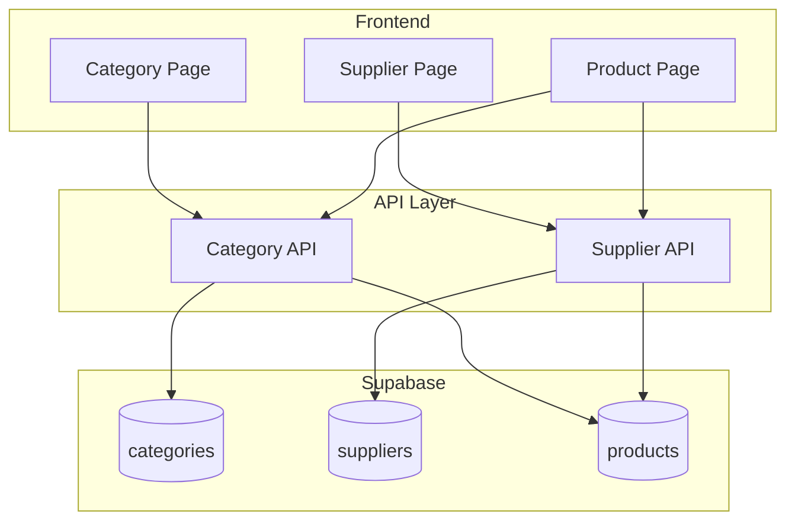

# Design Document: Manajemen Kategori & Supplier

## Overview

Fitur Manajemen Kategori dan Supplier menyediakan CRUD operations untuk data master kategori dan supplier. Implementasi mencakup halaman manajemen terpisah, API layer untuk operasi database, dan integrasi dengan halaman produk untuk assignment.

## Architecture



## Components and Interfaces

### 1. Category API (`src/api/categories.ts`)

```typescript
// Functions
async function listCategories(): Promise<Category[]>
async function createCategory(data: Omit<Category, 'id' | 'created_at'>): Promise<Category>
async function updateCategory(id: string, data: Partial<Category>): Promise<Category>
async function deleteCategory(id: string): Promise<void>
async function getCategoryProductCount(id: string): Promise<number>
```

### 2. Supplier API (`src/api/suppliers.ts`)

```typescript
// Functions
async function listSuppliers(): Promise<Supplier[]>
async function createSupplier(data: Omit<Supplier, 'id' | 'created_at'>): Promise<Supplier>
async function updateSupplier(id: string, data: Partial<Supplier>): Promise<Supplier>
async function deleteSupplier(id: string): Promise<void>
async function getSupplierProductCount(id: string): Promise<number>
```

## Data Models

### Database Schema

```sql
-- Categories table
CREATE TABLE IF NOT EXISTS public.categories (
    id UUID DEFAULT gen_random_uuid() PRIMARY KEY,
    name TEXT NOT NULL,
    description TEXT,
    created_at TIMESTAMP WITH TIME ZONE DEFAULT NOW()
);

-- Suppliers table
CREATE TABLE IF NOT EXISTS public.suppliers (
    id UUID DEFAULT gen_random_uuid() PRIMARY KEY,
    name TEXT NOT NULL,
    contact_person TEXT,
    phone TEXT,
    email TEXT,
    address TEXT,
    created_at TIMESTAMP WITH TIME ZONE DEFAULT NOW()
);
```

## Correctness Properties

*A property is a characteristic or behavior that should hold true across all valid executions of a system.*

### Property 1: Category CRUD Operations

*For any* category with valid name, creating it should return a category with the same name, updating it should persist changes, and deleting it (when no products assigned) should remove it from the list.

**Validates: Requirements 1.1, 1.2, 1.3, 1.4**

### Property 2: Supplier CRUD Operations

*For any* supplier with valid name, creating it should return a supplier with the same name, updating it should persist changes, and deleting it (when no products assigned) should remove it from the list.

**Validates: Requirements 2.1, 2.2, 2.3, 2.4**

### Property 3: Deletion Protection

*For any* category or supplier with assigned products, deletion should be prevented and return an error.

**Validates: Requirements 1.5, 2.5**

## Error Handling

| Error Scenario | Handling Strategy |
|----------------|-------------------|
| Duplicate name | Display validation error |
| Delete with products | Display warning, prevent deletion |
| Network error | Display error toast, allow retry |

## Testing Strategy

### Property-Based Testing

Library: **fast-check**

Tests will verify CRUD operations and deletion protection.

### Unit Tests

- Name validation
- Product count queries
