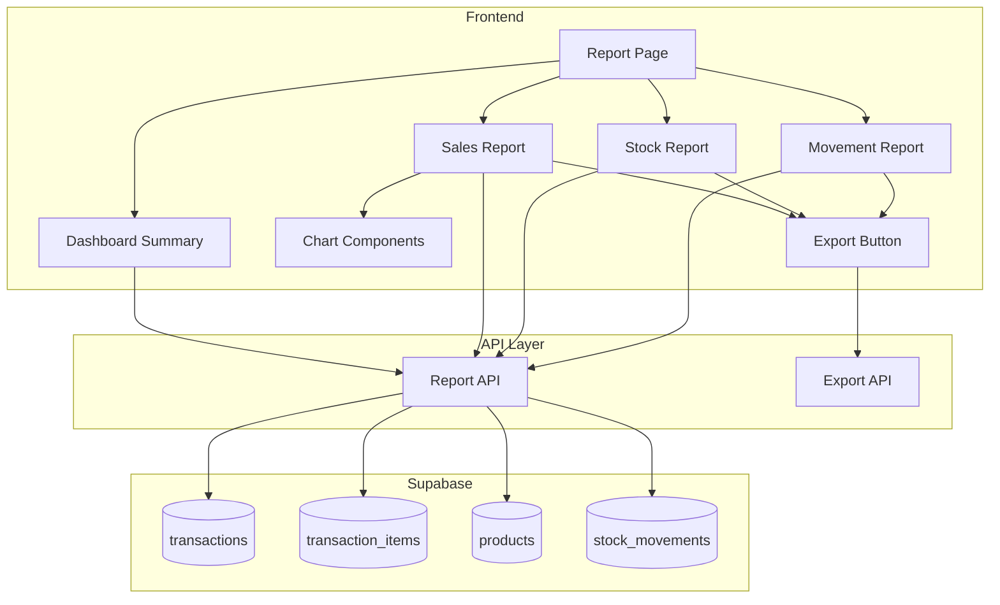

# Design Document: Laporan (Reports)

## Overview

Fitur Laporan menyediakan sistem pelaporan komprehensif untuk menganalisis data penjualan dan stok. Implementasi mencakup halaman Laporan baru dengan berbagai jenis laporan (penjualan, stok, pergerakan stok), visualisasi chart, dan kemampuan export ke CSV. Dashboard summary memberikan overview cepat tentang kondisi bisnis saat ini.

## Architecture



## Components and Interfaces

### 1. Report API (`src/api/reports.ts`)

```typescript
interface DateRange {
  startDate: string;
  endDate: string;
}

interface SalesReportData {
  totalSales: number;
  totalTransactions: number;
  averageTransaction: number;
  salesByPeriod: Array<{ period: string; amount: number; count: number }>;
  topProductsByQuantity: Array<{ productId: string; productName: string; quantity: number; revenue: number }>;
  topProductsByRevenue: Array<{ productId: string; productName: string; quantity: number; revenue: number }>;
}

interface StockReportData {
  products: Array<{
    productId: string;
    productName: string;
    currentStock: number;
    minStock: number;
    stockStatus: 'low' | 'normal' | 'overstocked';
    stockValue: number;
  }>;
  totalInventoryValue: number;
  lowStockCount: number;
}

interface StockMovementData {
  movements: Array<{
    id: string;
    date: string;
    productId: string;
    productName: string;
    movementType: 'in' | 'out' | 'adjustment';
    quantity: number;
    runningBalance: number;
    referenceType?: string;
    referenceId?: string;
  }>;
}

interface DashboardData {
  todaySales: number;
  todayTransactions: number;
  yesterdaySales: number;
  weekSales: number;
  lastWeekSales: number;
  lowStockCount: number;
  recentTransactions: Transaction[];
}

// Functions
async function getSalesReport(dateRange: DateRange, groupBy: 'hour' | 'day'): Promise<SalesReportData>
async function getStockReport(filters?: StockFilters): Promise<StockReportData>
async function getStockMovements(filters?: MovementFilters): Promise<StockMovementData>
async function getDashboardSummary(): Promise<DashboardData>
async function getProductSalesHistory(productId: string, dateRange: DateRange): Promise<SalesHistory>
```

### 2. Export API (`src/api/export.ts`)

```typescript
interface ExportOptions {
  reportType: 'sales' | 'stock' | 'movements';
  data: any[];
  columns: string[];
  filename: string;
}

// Functions
function generateCSV(data: any[], columns: string[]): string
function downloadCSV(content: string, filename: string): void
function exportReport(options: ExportOptions): void
```

### 3. UI Components

```typescript
// Dashboard Summary Component
interface DashboardSummaryProps {
  data: DashboardData;
  onViewDetails: (section: string) => void;
}

// Sales Report Component
interface SalesReportProps {
  dateRange: DateRange;
  onDateRangeChange: (range: DateRange) => void;
  onProductClick: (productId: string) => void;
}

// Stock Report Component
interface StockReportProps {
  filters: StockFilters;
  onFilterChange: (filters: StockFilters) => void;
}

// Movement Report Component
interface MovementReportProps {
  filters: MovementFilters;
  onFilterChange: (filters: MovementFilters) => void;
  onReferenceClick: (type: string, id: string) => void;
}

// Chart Components
interface SalesChartProps {
  data: Array<{ period: string; amount: number }>;
  type: 'line' | 'bar';
}

interface TopProductsChartProps {
  data: Array<{ name: string; value: number }>;
  metric: 'quantity' | 'revenue';
}
```

## Data Models

### Query Structures

```sql
-- Sales Report Query
SELECT 
  DATE_TRUNC('day', transaction_date) as period,
  SUM(total_amount) as total_sales,
  COUNT(*) as transaction_count,
  AVG(total_amount) as avg_transaction
FROM transactions
WHERE transaction_date BETWEEN :start_date AND :end_date
  AND status = 'completed'
GROUP BY DATE_TRUNC('day', transaction_date)
ORDER BY period;

-- Top Products Query
SELECT 
  p.id as product_id,
  p.name as product_name,
  SUM(ti.quantity) as total_quantity,
  SUM(ti.total_price) as total_revenue
FROM transaction_items ti
JOIN products p ON ti.product_id = p.id
JOIN transactions t ON ti.transaction_id = t.id
WHERE t.transaction_date BETWEEN :start_date AND :end_date
  AND t.status = 'completed'
GROUP BY p.id, p.name
ORDER BY total_quantity DESC
LIMIT 10;

-- Stock Report Query
SELECT 
  id as product_id,
  name as product_name,
  stock_quantity as current_stock,
  min_stock,
  CASE 
    WHEN stock_quantity <= min_stock THEN 'low'
    WHEN stock_quantity > min_stock * 3 THEN 'overstocked'
    ELSE 'normal'
  END as stock_status,
  stock_quantity * price as stock_value
FROM products
WHERE is_active = true
ORDER BY stock_status, name;

-- Stock Movements with Running Balance
SELECT 
  sm.id,
  sm.created_at as date,
  sm.product_id,
  p.name as product_name,
  sm.movement_type,
  sm.quantity,
  sm.reference_type,
  sm.reference_id,
  SUM(CASE WHEN sm.movement_type = 'out' THEN -sm.quantity ELSE sm.quantity END) 
    OVER (PARTITION BY sm.product_id ORDER BY sm.created_at) as running_balance
FROM stock_movements sm
JOIN products p ON sm.product_id = p.id
WHERE sm.created_at BETWEEN :start_date AND :end_date
ORDER BY sm.created_at DESC;
```

### TypeScript Interfaces

Interfaces `SalesReport` dan `StockReport` sudah didefinisikan di `src/types/index.ts`. Perlu ditambahkan interface untuk dashboard dan export.


## Correctness Properties

*A property is a characteristic or behavior that should hold true across all valid executions of a system-essentially, a formal statement about what the system should do. Properties serve as the bridge between human-readable specifications and machine-verifiable correctness guarantees.*

### Property 1: Sales Aggregation Accuracy

*For any* date range, the total sales amount should equal the sum of all completed transaction amounts in that range, the total transactions should equal the count of completed transactions, AND the average should equal total divided by count. For daily reports, data should be grouped by hour (0-23); for monthly reports, by day (1-31).

**Validates: Requirements 1.1, 1.3, 1.4**

### Property 2: Top Products Ranking

*For any* sales report, the top products by quantity should be sorted in descending order by quantity sold with maximum 10 items, the top products by revenue should be sorted in descending order by revenue with maximum 10 items, AND each product entry should include product name, quantity sold, and total revenue.

**Validates: Requirements 2.1, 2.2, 2.3**

### Property 3: Stock Report Data Integrity

*For any* stock report, all active products should be included with current stock and minimum stock level, products where stock_quantity <= min_stock should have status 'low', AND total inventory value should equal the sum of (stock_quantity × price) for all products.

**Validates: Requirements 3.1, 3.2, 3.4**

### Property 4: Stock Report Filtering

*For any* stock report filter by status, all returned products should have the matching stock status (low, normal, or overstocked).

**Validates: Requirements 3.3**

### Property 5: Stock Movements with Running Balance

*For any* stock movement query, each movement should include date, product, movement_type, quantity, and reference. The running balance for each product should be the cumulative sum of movements (positive for 'in', negative for 'out'). Filtered results should match the specified date range, product, and movement type.

**Validates: Requirements 4.1, 4.2, 4.3**

### Property 6: CSV Export Completeness

*For any* report export, the generated CSV should be valid CSV format, contain all columns from the report, contain all rows from the report data, AND the filename should include the report type and date range.

**Validates: Requirements 5.1, 5.2, 5.4**

### Property 7: Dashboard Summary Accuracy

*For any* dashboard query: today's sales should equal sum of today's completed transactions, yesterday comparison should be accurate, week sales should equal sum of this week's transactions, last week comparison should be accurate, low stock count should equal count of products where stock <= min_stock, AND recent transactions should return exactly 5 most recent completed transactions.

**Validates: Requirements 6.1, 6.2, 6.3, 6.4**

## Error Handling

| Error Scenario | Handling Strategy |
|----------------|-------------------|
| No data for selected period | Display zero values with informative message |
| Database query timeout | Display error message, suggest shorter date range |
| Export generation failure | Display error toast, allow retry |
| Invalid date range (end before start) | Display validation error, prevent query |
| Large dataset export | Show progress indicator, chunk data if needed |

## Testing Strategy

### Property-Based Testing

Library: **fast-check** (untuk TypeScript/JavaScript)

Property-based tests akan digunakan untuk memverifikasi correctness properties:

1. **Sales Aggregation Test**: Generate random transactions, verify totals match
2. **Top Products Test**: Generate random sales data, verify sorting and limits
3. **Stock Report Test**: Generate random products, verify status classification and totals
4. **Stock Filter Test**: Generate random filters, verify results match criteria
5. **Movement Balance Test**: Generate random movements, verify running balance calculation
6. **CSV Export Test**: Generate random report data, verify CSV format and completeness
7. **Dashboard Test**: Generate random data, verify all dashboard metrics

Setiap property test akan dikonfigurasi untuk menjalankan minimal 100 iterasi.

Format tag untuk property tests:
```typescript
// **Feature: laporan, Property 1: Sales Aggregation Accuracy**
```

### Unit Tests

Unit tests akan mencakup:
- Date range validation
- CSV formatting
- Percentage change calculation
- Stock status classification
- Running balance calculation

### Integration Tests

- End-to-end report generation
- Export download flow
- Dashboard data refresh
