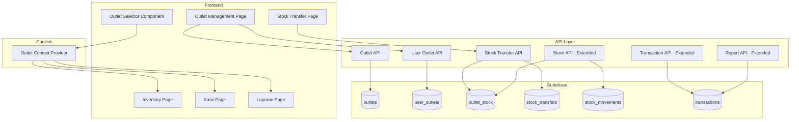

# Design Document: Multi-outlet

## Overview

Fitur Multi-outlet menyediakan sistem untuk mengelola beberapa toko atau cabang dalam satu aplikasi POS. Implementasi mencakup manajemen outlet, stok per outlet, transfer stok antar outlet, transaksi per outlet, dan laporan dengan filter outlet. Sistem menggunakan outlet context untuk memastikan semua operasi terisolasi per outlet.

## Architecture



## Components and Interfaces

### 1. Outlet API (`src/api/outlets.ts`)

```typescript
interface CreateOutletInput {
  name: string;
  address?: string;
  phone?: string;
  email?: string;
}

interface UpdateOutletInput {
  name?: string;
  address?: string;
  phone?: string;
  email?: string;
  is_active?: boolean;
}

// Functions
async function generateOutletCode(): Promise<string>
async function createOutlet(input: CreateOutletInput): Promise<Outlet>
async function getOutlets(includeInactive?: boolean): Promise<Outlet[]>
async function getOutletById(id: string): Promise<Outlet | null>
async function updateOutlet(id: string, input: UpdateOutletInput): Promise<Outlet>
async function deactivateOutlet(id: string): Promise<Outlet>
```

### 2. User Outlet API (`src/api/userOutlets.ts`)

```typescript
interface UserOutletAssignment {
  user_id: string;
  outlet_ids: string[];
  default_outlet_id?: string;
}

// Functions
async function assignUserToOutlets(assignment: UserOutletAssignment): Promise<void>
async function getUserOutlets(userId: string): Promise<Outlet[]>
async function getOutletUsers(outletId: string): Promise<User[]>
async function setDefaultOutlet(userId: string, outletId: string): Promise<void>
async function removeUserFromOutlet(userId: string, outletId: string): Promise<void>
```

### 3. Stock Transfer API (`src/api/stockTransfers.ts`)

```typescript
interface CreateTransferInput {
  source_outlet_id: string;
  destination_outlet_id: string;
  items: Array<{
    product_id: string;
    quantity: number;
  }>;
  notes?: string;
}

type TransferStatus = 'pending' | 'approved' | 'completed' | 'cancelled';

// Functions
async function createStockTransfer(input: CreateTransferInput): Promise<StockTransfer>
async function getStockTransfers(filters?: TransferFilters): Promise<StockTransfer[]>
async function getStockTransferById(id: string): Promise<StockTransfer | null>
async function approveStockTransfer(id: string): Promise<StockTransfer>
async function completeStockTransfer(id: string): Promise<StockTransfer>
async function cancelStockTransfer(id: string): Promise<StockTransfer>
```

### 4. Outlet Stock API (`src/api/outletStock.ts`)

```typescript
// Functions
async function getOutletStock(outletId: string): Promise<OutletStockItem[]>
async function getProductStockByOutlet(productId: string): Promise<OutletStockBreakdown[]>
async function updateOutletStock(outletId: string, productId: string, quantity: number): Promise<void>
async function initializeProductStock(productId: string): Promise<void>
async function transferStock(sourceOutletId: string, destOutletId: string, productId: string, quantity: number): Promise<void>
```

### 5. Outlet Context (`src/contexts/OutletContext.tsx`)

```typescript
interface OutletContextValue {
  currentOutlet: Outlet | null;
  availableOutlets: Outlet[];
  setCurrentOutlet: (outlet: Outlet) => void;
  isLoading: boolean;
}

// Provider component that wraps the app
function OutletProvider({ children }: { children: React.ReactNode }): JSX.Element

// Hook to access outlet context
function useOutlet(): OutletContextValue
```

### 6. UI Components

```typescript
// Outlet Selector Component (in header/navbar)
interface OutletSelectorProps {
  onOutletChange?: (outlet: Outlet) => void;
}

// Outlet List Component
interface OutletListProps {
  onSelect: (outlet: Outlet) => void;
  onCreateNew: () => void;
}

// Outlet Form Modal
interface OutletFormProps {
  isOpen: boolean;
  outlet?: Outlet;
  onSave: (outlet: Outlet) => void;
  onClose: () => void;
}

// User Outlet Assignment Modal
interface UserOutletAssignmentProps {
  isOpen: boolean;
  user: User;
  onSave: () => void;
  onClose: () => void;
}

// Stock Transfer Form
interface StockTransferFormProps {
  onSubmit: (transfer: StockTransfer) => void;
  onCancel: () => void;
}

// Stock Transfer List
interface StockTransferListProps {
  onSelect: (transfer: StockTransfer) => void;
}
```

## Data Models

### Database Schema

```sql
-- Outlets table
CREATE TABLE IF NOT EXISTS public.outlets (
    id UUID DEFAULT gen_random_uuid() PRIMARY KEY,
    code TEXT NOT NULL UNIQUE,
    name TEXT NOT NULL,
    address TEXT,
    phone TEXT,
    email TEXT,
    is_active BOOLEAN DEFAULT true,
    created_at TIMESTAMP WITH TIME ZONE DEFAULT NOW(),
    updated_at TIMESTAMP WITH TIME ZONE DEFAULT NOW()
);

-- User Outlets junction table
CREATE TABLE IF NOT EXISTS public.user_outlets (
    id UUID DEFAULT gen_random_uuid() PRIMARY KEY,
    user_id UUID REFERENCES auth.users(id) ON DELETE CASCADE,
    outlet_id UUID REFERENCES public.outlets(id) ON DELETE CASCADE,
    is_default BOOLEAN DEFAULT false,
    created_at TIMESTAMP WITH TIME ZONE DEFAULT NOW(),
    UNIQUE(user_id, outlet_id)
);

-- Outlet Stock table (stock per outlet per product)
CREATE TABLE IF NOT EXISTS public.outlet_stock (
    id UUID DEFAULT gen_random_uuid() PRIMARY KEY,
    outlet_id UUID REFERENCES public.outlets(id) ON DELETE CASCADE,
    product_id UUID REFERENCES public.products(id) ON DELETE CASCADE,
    quantity INTEGER NOT NULL DEFAULT 0,
    updated_at TIMESTAMP WITH TIME ZONE DEFAULT NOW(),
    UNIQUE(outlet_id, product_id)
);

-- Stock Transfers table
CREATE TABLE IF NOT EXISTS public.stock_transfers (
    id UUID DEFAULT gen_random_uuid() PRIMARY KEY,
    transfer_number TEXT NOT NULL UNIQUE,
    source_outlet_id UUID REFERENCES public.outlets(id),
    destination_outlet_id UUID REFERENCES public.outlets(id),
    status TEXT DEFAULT 'pending' CHECK (status IN ('pending', 'approved', 'completed', 'cancelled')),
    notes TEXT,
    created_by UUID REFERENCES auth.users(id),
    approved_by UUID REFERENCES auth.users(id),
    completed_at TIMESTAMP WITH TIME ZONE,
    created_at TIMESTAMP WITH TIME ZONE DEFAULT NOW(),
    updated_at TIMESTAMP WITH TIME ZONE DEFAULT NOW()
);

-- Stock Transfer Items table
CREATE TABLE IF NOT EXISTS public.stock_transfer_items (
    id UUID DEFAULT gen_random_uuid() PRIMARY KEY,
    transfer_id UUID REFERENCES public.stock_transfers(id) ON DELETE CASCADE,
    product_id UUID REFERENCES public.products(id),
    quantity INTEGER NOT NULL,
    created_at TIMESTAMP WITH TIME ZONE DEFAULT NOW()
);

-- Add outlet_id to existing tables
ALTER TABLE public.transactions ADD COLUMN IF NOT EXISTS outlet_id UUID REFERENCES public.outlets(id);
ALTER TABLE public.stock_movements ADD COLUMN IF NOT EXISTS outlet_id UUID REFERENCES public.outlets(id);
ALTER TABLE public.purchase_orders ADD COLUMN IF NOT EXISTS outlet_id UUID REFERENCES public.outlets(id);

-- RLS Policies
ALTER TABLE public.outlets ENABLE ROW LEVEL SECURITY;
ALTER TABLE public.user_outlets ENABLE ROW LEVEL SECURITY;
ALTER TABLE public.outlet_stock ENABLE ROW LEVEL SECURITY;
ALTER TABLE public.stock_transfers ENABLE ROW LEVEL SECURITY;

-- Users can view outlets they're assigned to (or all if admin)
CREATE POLICY "Users can view assigned outlets" ON public.outlets
    FOR SELECT USING (
        EXISTS (
            SELECT 1 FROM public.user_profiles WHERE id = auth.uid() AND role = 'admin'
        ) OR
        EXISTS (
            SELECT 1 FROM public.user_outlets WHERE user_id = auth.uid() AND outlet_id = outlets.id
        )
    );

-- Only admins can manage outlets
CREATE POLICY "Admins can manage outlets" ON public.outlets
    FOR ALL USING (
        EXISTS (
            SELECT 1 FROM public.user_profiles WHERE id = auth.uid() AND role = 'admin'
        )
    );
```

### TypeScript Interfaces

```typescript
export interface Outlet {
  id: string;
  code: string;
  name: string;
  address: string | null;
  phone: string | null;
  email: string | null;
  is_active: boolean;
  created_at: string;
  updated_at: string;
}

export interface UserOutlet {
  id: string;
  user_id: string;
  outlet_id: string;
  is_default: boolean;
  created_at: string;
}

export interface OutletStock {
  id: string;
  outlet_id: string;
  product_id: string;
  quantity: number;
  updated_at: string;
}

export interface StockTransfer {
  id: string;
  transfer_number: string;
  source_outlet_id: string;
  source_outlet?: Outlet;
  destination_outlet_id: string;
  destination_outlet?: Outlet;
  status: 'pending' | 'approved' | 'completed' | 'cancelled';
  notes: string | null;
  items?: StockTransferItem[];
  created_by: string;
  approved_by: string | null;
  completed_at: string | null;
  created_at: string;
  updated_at: string;
}

export interface StockTransferItem {
  id: string;
  transfer_id: string;
  product_id: string;
  product?: Product;
  quantity: number;
  created_at: string;
}
```

## Correctness Properties

*A property is a characteristic or behavior that should hold true across all valid executions of a system-essentially, a formal statement about what the system should do. Properties serve as the bridge between human-readable specifications and machine-verifiable correctness guarantees.*

### Property 1: Outlet Creation Data Persistence

*For any* valid outlet creation input, creating an outlet and then retrieving it should return all stored fields (name, address, phone, email) with matching values, a unique code should be generated, and is_active should default to true.

**Validates: Requirements 1.1, 1.2**

### Property 2: Outlet Code Uniqueness

*For any* number of outlets created, each outlet should have a unique code that is different from all other outlet codes.

**Validates: Requirements 1.2**

### Property 3: Outlet Deactivation and Filtering

*For any* deactivated outlet, it should have is_active = false, AND when listing active outlets, deactivated outlets should not appear.

**Validates: Requirements 1.4**

### Property 4: User Outlet Assignment

*For any* user-outlet assignment, the user should be able to access only their assigned outlets, AND admin users should be able to access all outlets regardless of assignment.

**Validates: Requirements 2.1, 2.3, 2.5**

### Property 5: Default Outlet Selection

*For any* user with a default outlet set, logging in should automatically select that outlet, AND the default outlet must be one of the user's assigned outlets.

**Validates: Requirements 7.1, 7.2**

### Property 6: Outlet-Scoped Stock

*For any* outlet and product, the stock quantity should be independent per outlet, AND updating stock for one outlet should not affect stock in other outlets.

**Validates: Requirements 3.1, 3.2**

### Property 7: Product Stock Initialization

*For any* newly created product, stock should be initialized to zero for all active outlets.

**Validates: Requirements 3.3**

### Property 8: Stock Transfer Validation

*For any* stock transfer request, the system should reject transfers where source outlet has insufficient stock for any item.

**Validates: Requirements 4.2**

### Property 9: Stock Transfer Completion

*For any* completed stock transfer, the source outlet stock should decrease by transfer quantity, the destination outlet stock should increase by transfer quantity, AND stock_movement records should be created for both outlets.

**Validates: Requirements 4.3, 4.4**

### Property 10: Outlet-Scoped Transactions

*For any* transaction created, it should be associated with the current outlet, AND stock should be deducted from the current outlet only.

**Validates: Requirements 5.1, 5.2**

### Property 11: Outlet-Scoped Transaction History

*For any* outlet, viewing transaction history should return only transactions from that outlet.

**Validates: Requirements 5.3**

### Property 12: Report Outlet Filtering

*For any* report with outlet filter: filtering by specific outlet should return data for that outlet only, AND filtering by "all outlets" should return combined data from all outlets.

**Validates: Requirements 6.2, 6.3**

## Error Handling

| Error Scenario | Handling Strategy |
|----------------|-------------------|
| Duplicate outlet code | Retry code generation (max 3 times) |
| User not assigned to outlet | Display error "Anda tidak memiliki akses ke outlet ini" |
| Insufficient stock for transfer | Display error "Stok tidak mencukupi di outlet asal" |
| Transfer to same outlet | Display error "Outlet tujuan harus berbeda dari outlet asal" |
| Deactivate outlet with pending transfers | Display warning, require confirmation |
| No outlet selected | Redirect to outlet selection page |
| Database error | Display error toast, allow retry |

## Testing Strategy

### Property-Based Testing

Library: **fast-check** (untuk TypeScript/JavaScript)

Property-based tests akan digunakan untuk memverifikasi correctness properties:

1. **Outlet Creation Test**: Generate random valid inputs, verify persistence and code generation
2. **Code Uniqueness Test**: Create multiple outlets, verify all codes unique
3. **Deactivation Test**: Deactivate outlets, verify filtering
4. **User Assignment Test**: Assign users, verify access control
5. **Default Outlet Test**: Set defaults, verify auto-selection
6. **Outlet Stock Test**: Update stock per outlet, verify isolation
7. **Stock Init Test**: Create products, verify zero stock for all outlets
8. **Transfer Validation Test**: Try transfers with insufficient stock, verify rejection
9. **Transfer Completion Test**: Complete transfers, verify stock changes
10. **Transaction Outlet Test**: Create transactions, verify outlet association
11. **Transaction History Test**: Query history, verify outlet filtering
12. **Report Filter Test**: Query reports with filters, verify results

Setiap property test akan dikonfigurasi untuk menjalankan minimal 100 iterasi.

Format tag untuk property tests:
```typescript
// **Feature: multi-outlet, Property 9: Stock Transfer Completion**
```

### Unit Tests

Unit tests akan mencakup:
- Outlet code generation format
- Stock transfer status transitions
- Outlet context state management
- Report aggregation logic
