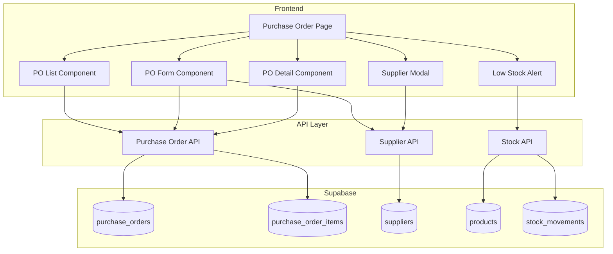

# Design Document: Purchase Order

## Overview

Fitur Purchase Order menyediakan sistem lengkap untuk mengelola pemesanan barang dari supplier. Implementasi mencakup halaman Pemesanan baru dengan kemampuan CRUD untuk purchase orders dan suppliers, integrasi dengan inventory untuk update stok otomatis, dan fitur low stock alert untuk memudahkan restocking.

## Architecture



## Components and Interfaces

### 1. Purchase Order API (`src/api/purchaseOrders.ts`)

```typescript
interface CreatePOInput {
  supplierId: string;
  expectedDate?: string;
  items: Array<{
    productId: string;
    quantity: number;
    unitPrice: number;
  }>;
}

interface UpdatePOStatusInput {
  id: string;
  status: 'approved' | 'cancelled' | 'received';
  receivedItems?: Array<{
    productId: string;
    receivedQuantity: number;
  }>;
  notes?: string;
}

// Functions
async function generatePONumber(): Promise<string>
async function createPurchaseOrder(input: CreatePOInput): Promise<PurchaseOrder>
async function getPurchaseOrders(filters?: POFilters): Promise<PurchaseOrder[]>
async function getPurchaseOrderById(id: string): Promise<PurchaseOrder | null>
async function updatePOStatus(input: UpdatePOStatusInput): Promise<PurchaseOrder>
async function receivePurchaseOrder(id: string, receivedItems: ReceivedItem[]): Promise<void>
```

### 2. Supplier API (`src/api/suppliers.ts`)

```typescript
interface CreateSupplierInput {
  name: string;
  contactPerson?: string;
  phone?: string;
  email?: string;
  address?: string;
}

// Functions
async function createSupplier(input: CreateSupplierInput): Promise<Supplier>
async function getSuppliers(): Promise<Supplier[]>
async function getSupplierById(id: string): Promise<Supplier | null>
async function updateSupplier(id: string, input: Partial<CreateSupplierInput>): Promise<Supplier>
async function deleteSupplier(id: string): Promise<void>
```

### 3. Stock API Extensions (`src/api/stock.ts`)

```typescript
// Additional functions
async function getLowStockProducts(): Promise<Product[]>
async function getSuggestedOrderQuantity(productId: string): Promise<number>
```

### 4. UI Components

```typescript
// PO List Component
interface POListProps {
  onSelect: (po: PurchaseOrder) => void;
  onCreateNew: () => void;
}

// PO Form Component
interface POFormProps {
  purchaseOrder?: PurchaseOrder;
  onSave: (po: PurchaseOrder) => void;
  onCancel: () => void;
}

// PO Detail Component
interface PODetailProps {
  purchaseOrder: PurchaseOrder;
  onApprove: () => void;
  onCancel: () => void;
  onReceive: (items: ReceivedItem[]) => void;
  onClose: () => void;
}

// Supplier Modal Component
interface SupplierModalProps {
  isOpen: boolean;
  supplier?: Supplier;
  onSave: (supplier: Supplier) => void;
  onClose: () => void;
}

// Low Stock Alert Component
interface LowStockAlertProps {
  onAddToOrder: (products: Product[]) => void;
}
```

## Data Models

### Database Schema

```sql
-- Suppliers table
CREATE TABLE IF NOT EXISTS public.suppliers (
    id UUID DEFAULT gen_random_uuid() PRIMARY KEY,
    name TEXT NOT NULL,
    contact_person TEXT,
    phone TEXT,
    email TEXT,
    address TEXT,
    is_active BOOLEAN DEFAULT true,
    created_at TIMESTAMP WITH TIME ZONE DEFAULT NOW(),
    updated_at TIMESTAMP WITH TIME ZONE DEFAULT NOW()
);

-- Purchase Orders table
CREATE TABLE IF NOT EXISTS public.purchase_orders (
    id UUID DEFAULT gen_random_uuid() PRIMARY KEY,
    order_number TEXT NOT NULL UNIQUE,
    supplier_id UUID REFERENCES public.suppliers(id),
    user_id UUID REFERENCES auth.users(id),
    total_amount NUMERIC(12, 2) NOT NULL DEFAULT 0,
    status TEXT DEFAULT 'pending' CHECK (status IN ('pending', 'approved', 'received', 'cancelled')),
    order_date TIMESTAMP WITH TIME ZONE DEFAULT NOW(),
    expected_date TIMESTAMP WITH TIME ZONE,
    received_date TIMESTAMP WITH TIME ZONE,
    notes TEXT,
    created_at TIMESTAMP WITH TIME ZONE DEFAULT NOW(),
    updated_at TIMESTAMP WITH TIME ZONE DEFAULT NOW()
);

-- Purchase Order Items table
CREATE TABLE IF NOT EXISTS public.purchase_order_items (
    id UUID DEFAULT gen_random_uuid() PRIMARY KEY,
    purchase_order_id UUID REFERENCES public.purchase_orders(id) ON DELETE CASCADE,
    product_id UUID REFERENCES public.products(id),
    quantity INTEGER NOT NULL,
    received_quantity INTEGER DEFAULT 0,
    unit_price NUMERIC(12, 2) NOT NULL,
    total_price NUMERIC(12, 2) NOT NULL,
    created_at TIMESTAMP WITH TIME ZONE DEFAULT NOW()
);
```

### TypeScript Interfaces

Interfaces `PurchaseOrder`, `PurchaseOrderItem`, dan `Supplier` sudah didefinisikan di `src/types/index.ts`.


## Correctness Properties

*A property is a characteristic or behavior that should hold true across all valid executions of a system-essentially, a formal statement about what the system should do. Properties serve as the bridge between human-readable specifications and machine-verifiable correctness guarantees.*

### Property 1: PO Creation Validation

*For any* purchase order creation request, the system should generate a unique order number in format PO-YYYYMMDD-XXXX, set initial status to 'pending', AND reject the request if no supplier is specified.

**Validates: Requirements 1.1, 1.4, 1.5**

### Property 2: PO Items and Total Calculation

*For any* purchase order with items, each item should have product_id, quantity, and unit_price recorded, AND the total_amount should equal the sum of (quantity × unit_price) for all items.

**Validates: Requirements 1.2, 1.3**

### Property 3: Status Transition Rules

*For any* purchase order status change: (1) approving a 'pending' PO should result in 'approved' status, (2) cancelling a PO should result in 'cancelled' status, (3) attempting to change status of 'received' or 'cancelled' PO should fail, AND (4) successful status changes should update the timestamp.

**Validates: Requirements 3.1, 3.2, 3.3, 3.4**

### Property 4: Receive PO and Stock Update

*For any* purchase order marked as received, the status should change to 'received', stock quantity for each product should increase by the received quantity, AND a stock_movement record with type 'in' should be created for each item.

**Validates: Requirements 4.1, 4.2, 4.3**

### Property 5: Partial Receipt Handling

*For any* purchase order receipt where received quantity differs from ordered quantity, the system should accept the partial receipt AND record the discrepancy in the notes field.

**Validates: Requirements 4.4, 4.5**

### Property 6: PO Filtering and Search

*For any* filter applied to purchase orders: (1) status filter should return only POs with matching status, (2) date range filter should return only POs within the range, AND (3) search should return POs matching order_number or supplier name.

**Validates: Requirements 2.2, 2.3, 2.4**

### Property 7: Supplier CRUD Operations

*For any* supplier creation or update, all provided fields (name, contact_person, phone, email, address) should be stored correctly, AND the supplier record should reflect the latest values after update.

**Validates: Requirements 5.1, 5.2**

### Property 8: Low Stock Query

*For any* low stock query, all returned products should have stock_quantity less than or equal to min_stock, AND each product should include name, current_stock, min_stock, and suggested_order_quantity.

**Validates: Requirements 6.1, 6.3**

## Error Handling

| Error Scenario | Handling Strategy |
|----------------|-------------------|
| Supplier not selected | Display validation error, prevent form submission |
| Empty PO items | Display validation error, require at least one item |
| Invalid status transition | Display error message explaining allowed transitions |
| Database save failure | Display error toast, retain form data for retry |
| Stock update failure during receive | Rollback transaction, display error, allow retry |
| Supplier deletion with existing POs | Prevent deletion, show warning about associated POs |
| Duplicate PO number | Retry with incremented sequence (max 3 retries) |

## Testing Strategy

### Property-Based Testing

Library: **fast-check** (untuk TypeScript/JavaScript)

Property-based tests akan digunakan untuk memverifikasi correctness properties:

1. **PO Creation Test**: Generate random PO inputs, verify number format, status, and supplier validation
2. **PO Items Test**: Generate random items, verify total calculation
3. **Status Transition Test**: Generate random status transitions, verify rules
4. **Receive PO Test**: Generate random receive scenarios, verify stock updates
5. **Partial Receipt Test**: Generate partial receipts, verify discrepancy handling
6. **Filter Test**: Generate random filters, verify results match criteria
7. **Supplier CRUD Test**: Generate random supplier data, verify persistence
8. **Low Stock Test**: Generate products with various stock levels, verify query results

Setiap property test akan dikonfigurasi untuk menjalankan minimal 100 iterasi.

Format tag untuk property tests:
```typescript
// **Feature: purchase-order, Property 1: PO Creation Validation**
```

### Unit Tests

Unit tests akan mencakup:
- PO number generation format
- Total amount calculation
- Status transition validation
- Date range filtering logic
- Search matching logic

### Integration Tests

- End-to-end PO creation flow
- Receive PO with stock update
- Supplier management with PO associations
