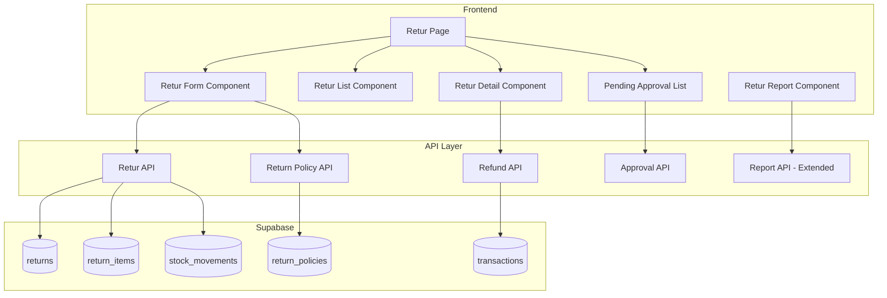

# Design Document: Retur/Refund

## Overview

Fitur Retur/Refund menyediakan sistem lengkap untuk mengelola pengembalian barang dari customer. Implementasi mencakup proses retur dengan referensi transaksi asli, perhitungan refund dengan diskon, update stok otomatis, return policy enforcement, approval workflow, dan laporan retur.

## Architecture



## Components and Interfaces

### 1. Retur API (`src/api/returns.ts`)

```typescript
type ReturnReason = 'damaged' | 'wrong_product' | 'not_as_described' | 'changed_mind' | 'other';
type ReturnStatus = 'pending_approval' | 'approved' | 'completed' | 'rejected' | 'cancelled';

interface CreateReturnInput {
  transaction_id: string;
  items: Array<{
    transaction_item_id: string;
    quantity: number;
    reason: ReturnReason;
    reason_detail?: string;
    is_damaged: boolean;
  }>;
  notes?: string;
}

interface Return {
  id: string;
  return_number: string;
  transaction_id: string;
  status: ReturnStatus;
  total_refund: number;
  refund_method: string | null;
  items: ReturnItem[];
  requires_approval: boolean;
  approved_by: string | null;
  approval_reason: string | null;
  rejected_reason: string | null;
  created_by: string;
  completed_at: string | null;
  created_at: string;
}

// Functions
async function generateReturnNumber(): Promise<string>
async function createReturn(input: CreateReturnInput): Promise<Return>
async function getReturns(filters?: ReturnFilters): Promise<Return[]>
async function getReturnById(id: string): Promise<Return | null>
async function getReturnsByTransaction(transactionId: string): Promise<Return[]>
async function completeReturn(id: string, refundMethod: string): Promise<Return>
async function cancelReturn(id: string): Promise<Return>
```

### 2. Refund API (`src/api/refunds.ts`)

```typescript
interface RefundCalculation {
  items: Array<{
    product_name: string;
    quantity: number;
    original_price: number;
    discount_amount: number;
    refund_amount: number;
  }>;
  subtotal: number;
  total_discount: number;
  total_refund: number;
}

// Functions
function calculateRefund(returnItems: ReturnItem[], originalTransaction: Transaction): RefundCalculation
async function processRefund(returnId: string, method: string): Promise<void>
```

### 3. Return Policy API (`src/api/returnPolicies.ts`)

```typescript
interface ReturnPolicy {
  id: string;
  max_return_days: number;
  non_returnable_categories: string[];
  require_receipt: boolean;
  is_active: boolean;
  created_at: string;
  updated_at: string;
}

interface PolicyCheckResult {
  allowed: boolean;
  requires_approval: boolean;
  reason?: string;
}

// Functions
async function getReturnPolicy(): Promise<ReturnPolicy>
async function updateReturnPolicy(policy: Partial<ReturnPolicy>): Promise<ReturnPolicy>
function checkReturnEligibility(transaction: Transaction, policy: ReturnPolicy): PolicyCheckResult
function isProductReturnable(productId: string, policy: ReturnPolicy): boolean
```

### 4. Approval API (`src/api/returnApprovals.ts`)

```typescript
interface ApprovalInput {
  return_id: string;
  approved: boolean;
  reason: string;
}

// Functions
async function getPendingApprovals(): Promise<Return[]>
async function approveReturn(input: ApprovalInput): Promise<Return>
async function rejectReturn(input: ApprovalInput): Promise<Return>
```

### 5. Return Report API (`src/api/returnReports.ts`)

```typescript
interface ReturnReportSummary {
  totalReturns: number;
  totalRefundAmount: number;
  returnsByReason: Record<ReturnReason, number>;
  topReturnedProducts: Array<{
    product_id: string;
    product_name: string;
    return_count: number;
    total_quantity: number;
  }>;
}

// Functions
async function getReturnReportSummary(dateRange: DateRange): Promise<ReturnReportSummary>
async function getReturnTrend(dateRange: DateRange): Promise<TrendData[]>
```

### 6. UI Components

```typescript
// Retur Form Component
interface ReturFormProps {
  onSubmit: (returnData: Return) => void;
  onCancel: () => void;
}

// Transaction Lookup Component
interface TransactionLookupProps {
  onTransactionFound: (transaction: Transaction) => void;
}

// Return Item Selector Component
interface ReturnItemSelectorProps {
  transaction: Transaction;
  existingReturns: Return[];
  onItemsSelected: (items: ReturnItemInput[]) => void;
}

// Retur Detail Component
interface ReturDetailProps {
  returnData: Return;
  onComplete: () => void;
  onCancel: () => void;
}

// Pending Approval List Component
interface PendingApprovalListProps {
  onApprove: (returnId: string, reason: string) => void;
  onReject: (returnId: string, reason: string) => void;
}
```

## Data Models

### Database Schema

```sql
-- Return Policies table
CREATE TABLE IF NOT EXISTS public.return_policies (
    id UUID DEFAULT gen_random_uuid() PRIMARY KEY,
    max_return_days INTEGER NOT NULL DEFAULT 7,
    non_returnable_categories UUID[] DEFAULT '{}',
    require_receipt BOOLEAN DEFAULT true,
    is_active BOOLEAN DEFAULT true,
    created_at TIMESTAMP WITH TIME ZONE DEFAULT NOW(),
    updated_at TIMESTAMP WITH TIME ZONE DEFAULT NOW()
);

-- Returns table
CREATE TABLE IF NOT EXISTS public.returns (
    id UUID DEFAULT gen_random_uuid() PRIMARY KEY,
    return_number TEXT NOT NULL UNIQUE,
    transaction_id UUID REFERENCES public.transactions(id),
    outlet_id UUID REFERENCES public.outlets(id),
    status TEXT DEFAULT 'pending_approval' CHECK (status IN ('pending_approval', 'approved', 'completed', 'rejected', 'cancelled')),
    total_refund NUMERIC(12, 2) NOT NULL DEFAULT 0,
    refund_method TEXT,
    requires_approval BOOLEAN DEFAULT false,
    approved_by UUID REFERENCES auth.users(id),
    approval_reason TEXT,
    rejected_reason TEXT,
    notes TEXT,
    created_by UUID REFERENCES auth.users(id),
    completed_at TIMESTAMP WITH TIME ZONE,
    created_at TIMESTAMP WITH TIME ZONE DEFAULT NOW(),
    updated_at TIMESTAMP WITH TIME ZONE DEFAULT NOW()
);

-- Return Items table
CREATE TABLE IF NOT EXISTS public.return_items (
    id UUID DEFAULT gen_random_uuid() PRIMARY KEY,
    return_id UUID REFERENCES public.returns(id) ON DELETE CASCADE,
    transaction_item_id UUID REFERENCES public.transaction_items(id),
    product_id UUID REFERENCES public.products(id),
    quantity INTEGER NOT NULL,
    original_price NUMERIC(12, 2) NOT NULL,
    discount_amount NUMERIC(12, 2) DEFAULT 0,
    refund_amount NUMERIC(12, 2) NOT NULL,
    reason TEXT NOT NULL CHECK (reason IN ('damaged', 'wrong_product', 'not_as_described', 'changed_mind', 'other')),
    reason_detail TEXT,
    is_damaged BOOLEAN DEFAULT false,
    is_resellable BOOLEAN DEFAULT true,
    created_at TIMESTAMP WITH TIME ZONE DEFAULT NOW()
);

-- Add returned_quantity to transaction_items
ALTER TABLE public.transaction_items ADD COLUMN IF NOT EXISTS returned_quantity INTEGER DEFAULT 0;

-- RLS Policies
ALTER TABLE public.returns ENABLE ROW LEVEL SECURITY;
ALTER TABLE public.return_items ENABLE ROW LEVEL SECURITY;
ALTER TABLE public.return_policies ENABLE ROW LEVEL SECURITY;

CREATE POLICY "Authenticated users can view returns" ON public.returns
    FOR SELECT USING (auth.role() = 'authenticated');

CREATE POLICY "Kasir can create returns" ON public.returns
    FOR INSERT WITH CHECK (auth.role() = 'authenticated');

CREATE POLICY "Managers can manage returns" ON public.returns
    FOR ALL USING (
        EXISTS (
            SELECT 1 FROM public.user_profiles
            WHERE id = auth.uid() AND role IN ('admin', 'manager')
        )
    );
```

### TypeScript Interfaces

```typescript
export type ReturnReason = 'damaged' | 'wrong_product' | 'not_as_described' | 'changed_mind' | 'other';
export type ReturnStatus = 'pending_approval' | 'approved' | 'completed' | 'rejected' | 'cancelled';

export interface Return {
  id: string;
  return_number: string;
  transaction_id: string;
  transaction?: Transaction;
  outlet_id: string | null;
  status: ReturnStatus;
  total_refund: number;
  refund_method: string | null;
  requires_approval: boolean;
  approved_by: string | null;
  approval_reason: string | null;
  rejected_reason: string | null;
  notes: string | null;
  created_by: string;
  completed_at: string | null;
  created_at: string;
  updated_at: string;
  items?: ReturnItem[];
}

export interface ReturnItem {
  id: string;
  return_id: string;
  transaction_item_id: string;
  product_id: string;
  product?: Product;
  quantity: number;
  original_price: number;
  discount_amount: number;
  refund_amount: number;
  reason: ReturnReason;
  reason_detail: string | null;
  is_damaged: boolean;
  is_resellable: boolean;
  created_at: string;
}

export interface ReturnPolicy {
  id: string;
  max_return_days: number;
  non_returnable_categories: string[];
  require_receipt: boolean;
  is_active: boolean;
  created_at: string;
  updated_at: string;
}
```

## Correctness Properties

*A property is a characteristic or behavior that should hold true across all valid executions of a system-essentially, a formal statement about what the system should do. Properties serve as the bridge between human-readable specifications and machine-verifiable correctness guarantees.*

### Property 1: Return Requires Valid Transaction

*For any* return creation attempt, the system should require a valid transaction_id, AND should return all items from that transaction for selection.

**Validates: Requirements 1.1, 1.2**

### Property 2: Return Quantity Validation

*For any* return item, the return quantity should not exceed (original_quantity - already_returned_quantity) from the transaction item.

**Validates: Requirements 1.4**

### Property 3: Return Number Format and Uniqueness

*For any* created return, the return_number should follow format RTN-YYYYMMDD-XXXX AND be unique across all returns.

**Validates: Requirements 1.5**

### Property 4: Refund Calculation with Discounts

*For any* return, the refund amount for each item should equal (original_price - discount_amount) × quantity, where discount_amount is the same discount applied in the original transaction.

**Validates: Requirements 2.1, 2.2**

### Property 5: Return Policy Enforcement

*For any* return attempt: if transaction date is beyond max_return_days, the return should require approval, AND if product category is in non_returnable_categories, the return should be rejected.

**Validates: Requirements 3.2, 3.4**

### Property 6: Stock Update on Return Completion

*For any* completed return: for each item where is_resellable = true, stock should increase by return quantity, AND a stock_movement record with type 'return' should be created. For items where is_resellable = false, stock should NOT increase.

**Validates: Requirements 4.1, 4.2, 4.4**

### Property 7: Return Report Accuracy

*For any* date range, the return report should show: total_returns equal to count of completed returns, total_refund_amount equal to sum of total_refund, AND breakdown by reason should sum to total returns.

**Validates: Requirements 5.1, 5.2, 5.3**

### Property 8: Return Receipt Content

*For any* completed return, the generated receipt should contain: return_number, original transaction_number, all returned items with quantities and refund amounts, total refund amount, return date, and kasir name.

**Validates: Requirements 6.1, 6.2, 6.3**

### Property 9: Approval Workflow

*For any* return requiring approval: when approved, the return should record approver_id and approval_reason, AND when rejected, the return should record rejected_reason and status should be 'rejected'.

**Validates: Requirements 7.2, 7.3**

### Property 10: Pending Approvals List

*For any* query for pending approvals, the result should contain only returns with status = 'pending_approval' AND requires_approval = true.

**Validates: Requirements 7.4**

## Error Handling

| Error Scenario | Handling Strategy |
|----------------|-------------------|
| Transaction not found | Display "Transaksi tidak ditemukan" |
| Return quantity exceeds available | Display "Jumlah retur melebihi yang tersedia" |
| Non-returnable product | Display "Produk tidak dapat diretur sesuai kebijakan toko" |
| Return period expired | Display warning, require manager approval |
| Already fully returned | Display "Item sudah diretur sepenuhnya" |
| Approval required | Display "Menunggu persetujuan manager" |
| Database error | Display error toast, allow retry |

## Testing Strategy

### Property-Based Testing

Library: **fast-check** (untuk TypeScript/JavaScript)

Property-based tests akan digunakan untuk memverifikasi correctness properties:

1. **Transaction Requirement Test**: Try returns without transaction, verify rejection
2. **Quantity Validation Test**: Try over-returns, verify rejection
3. **Return Number Test**: Create returns, verify format and uniqueness
4. **Refund Calculation Test**: Calculate refunds, verify discount preservation
5. **Policy Enforcement Test**: Test returns against policy, verify enforcement
6. **Stock Update Test**: Complete returns, verify stock changes
7. **Report Accuracy Test**: Generate reports, verify aggregations
8. **Receipt Content Test**: Generate receipts, verify content
9. **Approval Workflow Test**: Approve/reject returns, verify data recording
10. **Pending List Test**: Query pending, verify filtering

Setiap property test akan dikonfigurasi untuk menjalankan minimal 100 iterasi.

Format tag untuk property tests:
```typescript
// **Feature: retur-refund, Property 4: Refund Calculation with Discounts**
```

### Unit Tests

Unit tests akan mencakup:
- Return number generation format
- Refund calculation formulas
- Policy date checking
- Stock movement creation
