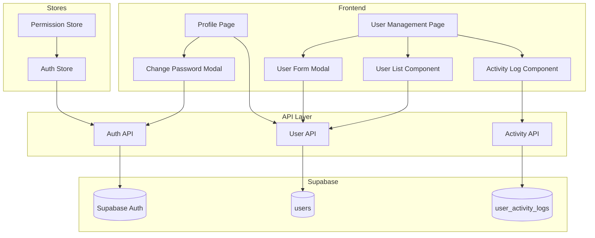

# Design Document: User Management

## Overview

Fitur User Management menyediakan sistem lengkap untuk mengelola pengguna aplikasi POS dengan role-based access control. Implementasi mencakup CRUD user, manajemen role dan permission, password management, dan activity logging. Sistem ini terintegrasi dengan Supabase Auth untuk autentikasi yang aman.

## Architecture



## Components and Interfaces

### 1. User API (`src/api/users.ts`)

```typescript
interface CreateUserInput {
  email: string;
  password: string;
  full_name: string;
  role: 'admin' | 'manager' | 'kasir';
}

interface UpdateUserInput {
  full_name?: string;
  email?: string;
  role?: 'admin' | 'manager' | 'kasir';
  is_active?: boolean;
}

interface UserFilters {
  search?: string;
  role?: string;
  is_active?: boolean;
}

// Functions
async function createUser(input: CreateUserInput): Promise<User>
async function getUsers(filters?: UserFilters): Promise<User[]>
async function getUserById(id: string): Promise<User | null>
async function updateUser(id: string, input: UpdateUserInput): Promise<User>
async function deactivateUser(id: string): Promise<User>
async function reactivateUser(id: string): Promise<User>
async function resetUserPassword(id: string): Promise<{ temporaryPassword: string }>
```

### 2. Auth API (`src/api/auth.ts`)

```typescript
interface LoginInput {
  email: string;
  password: string;
}

interface ChangePasswordInput {
  currentPassword: string;
  newPassword: string;
  confirmPassword: string;
}

// Functions
async function login(input: LoginInput): Promise<User>
async function logout(): Promise<void>
async function changePassword(input: ChangePasswordInput): Promise<void>
async function getCurrentUser(): Promise<User | null>
```

### 3. Activity API (`src/api/activity.ts`)

```typescript
interface ActivityLog {
  id: string;
  user_id: string;
  event_type: 'login_success' | 'login_failure' | 'logout' | 'password_change';
  ip_address: string;
  user_agent: string;
  created_at: string;
}

// Functions
async function logActivity(userId: string, eventType: string, metadata?: object): Promise<void>
async function getUserActivity(userId: string, days?: number): Promise<ActivityLog[]>
```

### 4. Permission Utilities (`src/lib/permissions.ts`)

```typescript
type Permission = 
  | 'users.view' | 'users.create' | 'users.edit' | 'users.delete'
  | 'inventory.view' | 'inventory.edit'
  | 'kasir.access'
  | 'pemesanan.view' | 'pemesanan.create' | 'pemesanan.edit'
  | 'laporan.view'
  | 'kategori.view' | 'kategori.edit'
  | 'supplier.view' | 'supplier.edit'
  | 'settings.view' | 'settings.edit';

const ROLE_PERMISSIONS: Record<string, Permission[]> = {
  admin: ['*'], // All permissions
  manager: [
    'inventory.view', 'inventory.edit',
    'pemesanan.view', 'pemesanan.create', 'pemesanan.edit',
    'laporan.view',
    'kategori.view', 'kategori.edit',
    'supplier.view', 'supplier.edit',
  ],
  kasir: [
    'kasir.access',
    'laporan.view', // Dashboard only
  ],
};

function hasPermission(role: string, permission: Permission): boolean
function getAccessibleRoutes(role: string): string[]
function canAccessRoute(role: string, route: string): boolean
```

### 5. UI Components

```typescript
// User List Component
interface UserListProps {
  onSelect: (user: User) => void;
  onCreateNew: () => void;
}

// User Form Modal
interface UserFormProps {
  isOpen: boolean;
  user?: User;
  onSave: (user: User) => void;
  onClose: () => void;
}

// Activity Log Component
interface ActivityLogProps {
  userId: string;
}

// Change Password Modal
interface ChangePasswordModalProps {
  isOpen: boolean;
  onClose: () => void;
  onSuccess: () => void;
}
```

## Data Models

### Database Schema

```sql
-- Extend users table with additional fields
-- Note: Supabase Auth handles email/password, we store profile data
CREATE TABLE IF NOT EXISTS public.user_profiles (
    id UUID PRIMARY KEY REFERENCES auth.users(id) ON DELETE CASCADE,
    full_name TEXT NOT NULL,
    role TEXT NOT NULL DEFAULT 'kasir' CHECK (role IN ('admin', 'manager', 'kasir')),
    is_active BOOLEAN DEFAULT true,
    must_change_password BOOLEAN DEFAULT false,
    last_login_at TIMESTAMP WITH TIME ZONE,
    created_at TIMESTAMP WITH TIME ZONE DEFAULT NOW(),
    updated_at TIMESTAMP WITH TIME ZONE DEFAULT NOW()
);

-- User activity logs table
CREATE TABLE IF NOT EXISTS public.user_activity_logs (
    id UUID DEFAULT gen_random_uuid() PRIMARY KEY,
    user_id UUID REFERENCES auth.users(id) ON DELETE CASCADE,
    event_type TEXT NOT NULL CHECK (event_type IN ('login_success', 'login_failure', 'logout', 'password_change')),
    ip_address TEXT,
    user_agent TEXT,
    metadata JSONB,
    created_at TIMESTAMP WITH TIME ZONE DEFAULT NOW()
);

-- RLS Policies
ALTER TABLE public.user_profiles ENABLE ROW LEVEL SECURITY;
ALTER TABLE public.user_activity_logs ENABLE ROW LEVEL SECURITY;

-- Only admins can manage users
CREATE POLICY "Admins can manage user profiles" ON public.user_profiles
    FOR ALL USING (
        EXISTS (
            SELECT 1 FROM public.user_profiles
            WHERE id = auth.uid() AND role = 'admin'
        )
    );

-- Users can view their own profile
CREATE POLICY "Users can view own profile" ON public.user_profiles
    FOR SELECT USING (id = auth.uid());

-- Users can view their own activity
CREATE POLICY "Users can view own activity" ON public.user_activity_logs
    FOR SELECT USING (user_id = auth.uid());

-- Admins can view all activity
CREATE POLICY "Admins can view all activity" ON public.user_activity_logs
    FOR SELECT USING (
        EXISTS (
            SELECT 1 FROM public.user_profiles
            WHERE id = auth.uid() AND role = 'admin'
        )
    );
```

### TypeScript Interfaces

```typescript
// Update User interface in src/types/index.ts
export interface User {
  id: string;
  email: string;
  full_name: string;
  role: 'admin' | 'manager' | 'kasir';
  is_active: boolean;
  must_change_password: boolean;
  last_login_at: string | null;
  created_at: string;
  updated_at: string;
}

export interface UserActivityLog {
  id: string;
  user_id: string;
  event_type: 'login_success' | 'login_failure' | 'logout' | 'password_change';
  ip_address: string | null;
  user_agent: string | null;
  metadata: Record<string, any> | null;
  created_at: string;
}
```

## Correctness Properties

*A property is a characteristic or behavior that should hold true across all valid executions of a system-essentially, a formal statement about what the system should do. Properties serve as the bridge between human-readable specifications and machine-verifiable correctness guarantees.*

### Property 1: User Creation Data Persistence

*For any* valid user creation input (valid email, password >= 8 chars, valid role), creating a user and then retrieving it should return all stored fields (email, full_name, role) with matching values, and is_active should default to true.

**Validates: Requirements 1.1, 1.4**

### Property 2: Email Validation and Uniqueness

*For any* email string, the system should reject invalid email formats, AND for any existing user email, attempting to create another user with the same email should fail.

**Validates: Requirements 1.2**

### Property 3: Password Minimum Length Validation

*For any* password string with length less than 8 characters, user creation or password change should be rejected.

**Validates: Requirements 1.3, 4.2**

### Property 4: Role Validation

*For any* user creation or update, the role must be exactly one of 'admin', 'manager', or 'kasir', AND any other role value should be rejected.

**Validates: Requirements 1.5**

### Property 5: User Update Persistence

*For any* valid update to a user (name, email, role, status), retrieving the user after update should reflect the new values.

**Validates: Requirements 2.2**

### Property 6: User Status and Login Access

*For any* user, when deactivated (is_active = false), login attempts should fail, AND when reactivated (is_active = true), login attempts with correct credentials should succeed.

**Validates: Requirements 2.3, 2.4**

### Property 7: User Search Filtering

*For any* search query, the returned users should all have name OR email containing the search string (case-insensitive).

**Validates: Requirements 2.5**

### Property 8: Password Reset Flag

*For any* password reset operation, the user's must_change_password flag should be set to true, AND a non-empty temporary password should be returned.

**Validates: Requirements 3.1, 3.2**

### Property 9: Password Change Validation

*For any* password change attempt, if current password is incorrect, the change should fail, AND if new password and confirmation don't match, the change should fail.

**Validates: Requirements 4.1, 4.3**

### Property 10: Role-Based Permission Access

*For any* role and permission combination: admin should have all permissions, manager should have inventory/pemesanan/laporan/kategori/supplier permissions but not user management, kasir should have only kasir and dashboard permissions.

**Validates: Requirements 5.1, 5.2, 5.3**

### Property 11: Activity Log Completeness

*For any* login event (success or failure), an activity log entry should be created with user_id, event_type, timestamp, AND the log should only return entries from the last 30 days.

**Validates: Requirements 7.1, 7.2, 7.3**

## Error Handling

| Error Scenario | Handling Strategy |
|----------------|-------------------|
| Invalid email format | Display validation error, prevent form submission |
| Duplicate email | Display error "Email sudah terdaftar" |
| Password too short | Display error "Password minimal 8 karakter" |
| Invalid role | Display error, require valid role selection |
| Deactivated user login | Display error "Akun tidak aktif, hubungi admin" |
| Wrong current password | Display error "Password saat ini salah" |
| Password mismatch | Display error "Konfirmasi password tidak cocok" |
| Unauthorized access | Redirect to dashboard with "Akses ditolak" message |
| Database error | Display error toast, allow retry |

## Testing Strategy

### Property-Based Testing

Library: **fast-check** (untuk TypeScript/JavaScript)

Property-based tests akan digunakan untuk memverifikasi correctness properties:

1. **User Creation Test**: Generate random valid inputs, verify persistence
2. **Email Validation Test**: Generate random strings, verify email format validation
3. **Password Validation Test**: Generate passwords of various lengths, verify minimum length
4. **Role Validation Test**: Generate random role strings, verify only valid roles accepted
5. **User Update Test**: Generate random updates, verify persistence
6. **Status Login Test**: Toggle status, verify login behavior
7. **Search Test**: Generate users and search queries, verify filtering
8. **Password Reset Test**: Reset passwords, verify flag and temp password
9. **Password Change Test**: Test with various current/new password combinations
10. **Permission Test**: Test all role/permission combinations
11. **Activity Log Test**: Generate events, verify logging and date filtering

Setiap property test akan dikonfigurasi untuk menjalankan minimal 100 iterasi.

Format tag untuk property tests:
```typescript
// **Feature: user-management, Property 1: User Creation Data Persistence**
```

### Unit Tests

Unit tests akan mencakup:
- Email format validation regex
- Password strength validation
- Role permission mapping
- Route access control
- Activity log date filtering
