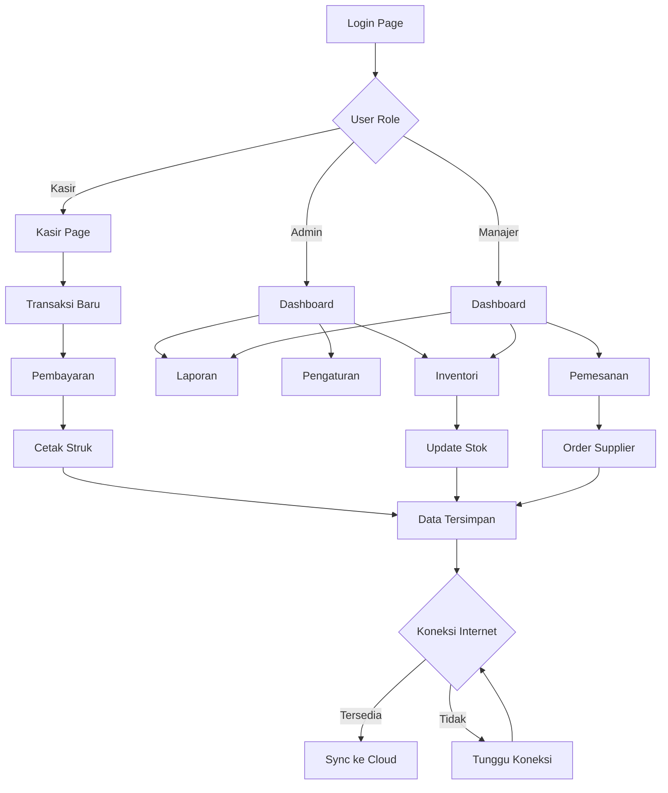

## 1. Product Overview
Aplikasi POS (Point of Sale) terintegrasi dengan sistem inventori dan pemesanan yang dirancang untuk usaha retail dan restoran. Sistem ini mendukung mode offline-first dengan sinkronisasi otomatis ketika koneksi tersedia.

Aplikasi ini membantu pengelolaan transaksi penjualan, stok barang, dan pemesanan secara efisien dengan tampilan modern yang mewah. Cocok untuk usaha kecil hingga menengah yang membutuhkan sistem kasir profesional.

## 2. Core Features

### 2.1 User Roles
| Role | Registration Method | Core Permissions |
|------|---------------------|------------------|
| Admin/Owner | Email registration | Full access ke semua fitur, manajemen user, laporan lengkap |
| Kasir | Didaftarkan oleh admin | Transaksi penjualan, lihat stok, cetak struk |
| Manajer | Didaftarkan oleh admin | Transaksi, inventori, laporan penjualan, manajemen pesanan |

### 2.2 Feature Module
Aplikasi ini terdiri dari halaman-halaman utama berikut:

1. **Dashboard**: Tampilan utama dengan ringkasan penjualan harian, grafik performa, dan quick access menu.
2. **Kasir**: Halaman transaksi penjualan dengan cart, pembayaran, dan cetak struk.
3. **Inventori**: Manajemen stok barang, kategori, supplier, dan pergerakan stok.
4. **Pemesanan**: Sistem order management untuk pesanan customer dan restock supplier.
5. **Laporan**: Analisis penjualan, laporan stok, dan laporan keuangan.
6. **Pengaturan**: Konfigurasi aplikasi, manajemen user, dan backup data.

### 2.3 Page Details
| Page Name | Module Name | Feature description |
|-----------|-------------|---------------------|
| Dashboard | Ringkasan Penjualan | Tampilkan total penjualan hari ini, grafik penjualan 7 hari terakhir, dan produk terlaris |
| Dashboard | Quick Actions | Tombol cepat untuk transaksi baru, tambah produk, dan lihat stok menipis |
| Kasir | Cart Management | Tambah/hapus item, ubah quantity, diskon per item atau total |
| Kasir | Pembayaran | Multiple payment methods (tunai, kartu, e-wallet), hitung otomatis kembalian |
| Kasir | Cetak Struk | Generate dan cetak struk thermal dengan informasi lengkap transaksi |
| Inventori | Manajemen Produk | CRUD produk dengan barcode, foto, harga, dan stok |
| Inventori | Kategori & Supplier | Kelola kategori produk dan informasi supplier |
| Inventori | Stok Management | Update stop manual, stok opname, dan alert stok minimum |
| Pemesanan | Order Entry | Buat pesanan customer dengan detail item dan status |
| Pemesanan | Supplier Orders | Buat PO untuk restock dari supplier dengan tracking status |
| Laporan | Penjualan Report | Filter laporan by date range, export PDF/Excel, grafik tren |
| Laporan | Stok Report | Laporan pergerakan stok, produk kadaluarsa, dan nilai inventori |
| Pengaturan | User Management | Tambah/edit user dengan role dan permission |
| Pengaturan | Backup & Restore | Backup data lokal dan restore dari file |
| Pengaturan | Aplikasi Config | Seting printer, tax rate, currency, dan tema aplikasi |

## 3. Core Process

### Admin/Owner Flow
1. Login ke aplikasi dengan kredensial admin
2. Setup konfigurasi awal: informasi toko, printer, pajak
3. Tambahkan user kasir dan manajer
4. Import atau tambahkan data produk awal
5. Monitor dashboard untuk performa penjualan
6. Kelola inventori dan lihat laporan secara berkala

### Kasir Flow
1. Login dengan akun kasir
2. Buka halaman kasir untuk transaksi baru
3. Scan barcode atau cari produk manual
4. Tambahkan item ke cart
5. Proses pembayaran sesuai metode yang dipilih
6. Cetak struk untuk customer
7. Transaksi tersimpan secara lokal dan siap sync

### Manajer Flow
1. Login dengan akun manajer
2. Akses inventori untuk update stok produk
3. Buat pesanan untuk restock dari supplier
4. Monitor laporan penjualan harian/mingguan
5. Kelola return produk dan adjustment stok

## 4. User Interface Design

### 4.1 Design Style
- **Primary Color**: Deep Purple (#6B46C1) - memberikan kesan mewah dan profesional
- **Secondary Color**: Gold (#FFD700) - aksen elegan untuk elemen penting
- **Background**: Gradient dark to light (#1A1A2E to #16213E) - tampilan modern
- **Button Style**: Rounded corners dengan shadow effect, hover animation
- **Font**: Inter untuk body, Poppins untuk heading - clean dan modern
- **Layout**: Card-based design dengan glassmorphism effect
- **Icons**: Heroicons outline style untuk konsistensi
- **Animation**: Smooth transitions dan micro-interactions

### 4.2 Page Design Overview
| Page Name | Module Name | UI Elements |
|-----------|-------------|-------------|
| Dashboard | Ringkasan Penjualan | Card dengan total penjualan hari ini, icon mata uang gold, font size 24px bold |
| Dashboard | Grafik | Line chart dengan gradient purple to pink, animasi saat load |
| Kasir | Cart Section | White card dengan border-radius 12px, shadow-lg, item list dengan hover effect |
| Kasir | Payment Section | Glassmorphism panel dengan backdrop blur, tombol payment besar dengan warna gold |
| Inventori | Product Grid | Card-based layout dengan product image, tombol action dengan icon |
| Inventori | Search Bar | Rounded search bar dengan icon dan placeholder text |
| Laporan | Filter Section | Dropdown modern dengan chevron icon, date picker custom |
| Pengaturan | Settings Menu | List menu dengan icon dan arrow right, divider antar section |

### 4.3 Responsiveness
- **Desktop-First**: Dioptimalkan untuk layar 1366px ke atas
- **Tablet Support**: Responsive breakpoint 768px dengan layout yang disesuaikan
- **Mobile**: Mode landscape untuk tablet, portrait untuk smartphone
- **Touch Optimization**: Tombol besar untuk touch target, swipe gesture untuk cart
- **Print**: Layout khusus untuk struk thermal printer 58mm