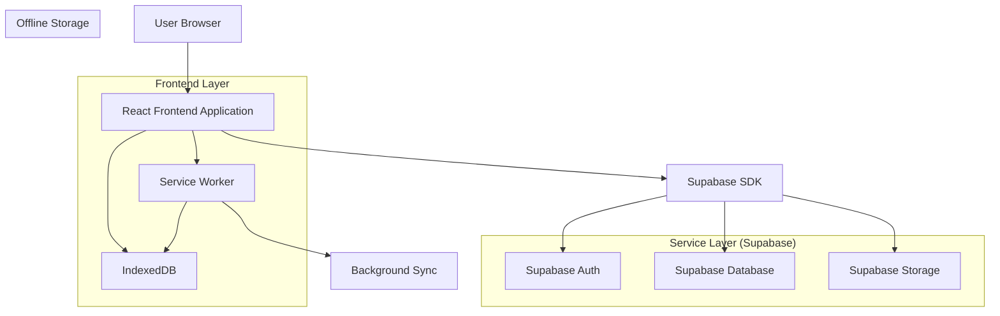
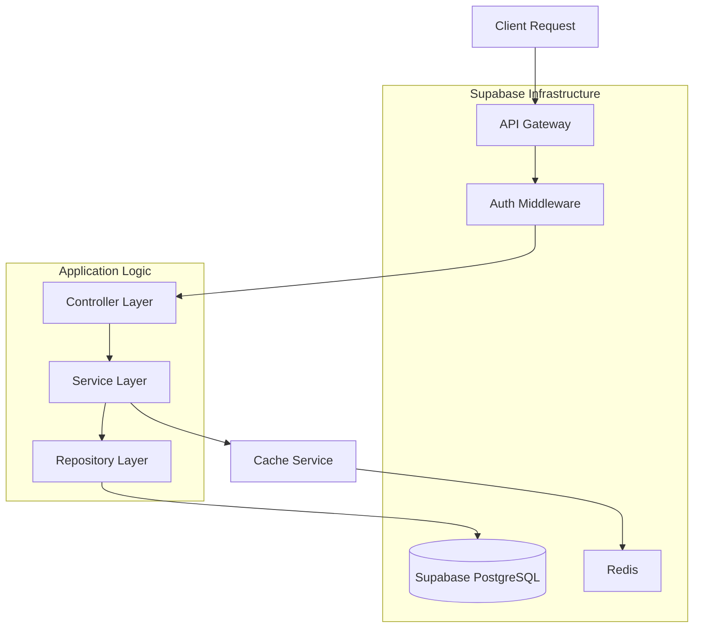
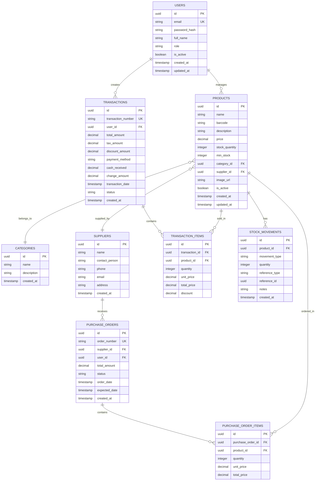

## 1. Architecture Design



## 2. Technology Description

- **Frontend**: React@18 + TypeScript + Vite
- **Styling**: TailwindCSS@3 + Framer Motion untuk animasi
- **State Management**: Zustand untuk global state
- **Database Lokal**: IndexedDB dengan Dexie.js wrapper
- **Offline Sync**: Service Worker dengan Background Sync API
- **Backend**: Supabase (PostgreSQL, Auth, Storage)
- **UI Components**: HeadlessUI + Radix UI
- **Initialization Tool**: vite-init

## 3. Route Definitions

| Route | Purpose |
|-------|---------|
| / | Dashboard utama dengan ringkasan penjualan |
| /login | Halaman autentikasi user |
| /kasir | Interface transaksi penjualan |
| /inventori | Manajemen produk dan stok |
| /inventori/produk | List dan CRUD produk |
| /inventori/kategori | Manajemen kategori produk |
| /inventori/supplier | Data supplier dan kontak |
| /pemesanan | Sistem order management |
| /pemesanan/baru | Buat pesanan baru |
| /pemesanan/supplier | Purchase order untuk restock |
| /laporan | Halaman laporan dan analisis |
| /laporan/penjualan | Laporan penjualan dengan filter |
| /laporan/stok | Laporan pergerakan stok |
| /pengaturan | Konfigurasi aplikasi |
| /pengaturan/user | Manajemen user dan role |
| /pengaturan/backup | Backup dan restore data |

## 4. API Definitions

### 4.1 Authentication API

```
POST /auth/v1/token
```

Request:
| Param Name | Param Type | isRequired | Description |
|------------|------------|------------|-------------|
| email | string | true | Email user |
| password | string | true | Password user |

Response:
| Param Name | Param Type | Description |
|------------|------------|-------------|
| access_token | string | JWT token untuk autentikasi |
| refresh_token | string | Token untuk refresh session |
| user | object | Data user yang login |

### 4.2 Transactions API

```
POST /rest/v1/transactions
```

Request:
| Param Name | Param Type | isRequired | Description |
|------------|------------|------------|-------------|
| items | array | true | Array item transaksi |
| total_amount | number | true | Total pembayaran |
| payment_method | string | true | Metode pembayaran |
| customer_info | object | false | Info customer (optional) |

### 4.3 Products API

```
GET /rest/v1/products
```

Query Parameters:
| Param Name | Param Type | Description |
|------------|------------|-------------|
| category | string | Filter by category |
| search | string | Search by name/barcode |
| limit | number | Limit results |
| offset | number | Pagination offset |

## 5. Server Architecture Diagram



## 6. Data Model

### 6.1 Database Schema



### 6.2 Data Definition Language

```sql
-- Users table
CREATE TABLE users (
    id UUID PRIMARY KEY DEFAULT gen_random_uuid(),
    email VARCHAR(255) UNIQUE NOT NULL,
    password_hash VARCHAR(255) NOT NULL,
    full_name VARCHAR(255) NOT NULL,
    role VARCHAR(50) DEFAULT 'cashier' CHECK (role IN ('admin', 'manager', 'cashier')),
    is_active BOOLEAN DEFAULT true,
    created_at TIMESTAMP WITH TIME ZONE DEFAULT NOW(),
    updated_at TIMESTAMP WITH TIME ZONE DEFAULT NOW()
);

-- Categories table
CREATE TABLE categories (
    id UUID PRIMARY KEY DEFAULT gen_random_uuid(),
    name VARCHAR(100) NOT NULL,
    description TEXT,
    created_at TIMESTAMP WITH TIME ZONE DEFAULT NOW()
);

-- Suppliers table
CREATE TABLE suppliers (
    id UUID PRIMARY KEY DEFAULT gen_random_uuid(),
    name VARCHAR(255) NOT NULL,
    contact_person VARCHAR(255),
    phone VARCHAR(50),
    email VARCHAR(255),
    address TEXT,
    created_at TIMESTAMP WITH TIME ZONE DEFAULT NOW()
);

-- Products table
CREATE TABLE products (
    id UUID PRIMARY KEY DEFAULT gen_random_uuid(),
    name VARCHAR(255) NOT NULL,
    barcode VARCHAR(100) UNIQUE,
    description TEXT,
    price DECIMAL(10,2) NOT NULL,
    stock_quantity INTEGER DEFAULT 0,
    min_stock INTEGER DEFAULT 5,
    category_id UUID REFERENCES categories(id),
    supplier_id UUID REFERENCES suppliers(id),
    image_url TEXT,
    is_active BOOLEAN DEFAULT true,
    created_at TIMESTAMP WITH TIME ZONE DEFAULT NOW(),
    updated_at TIMESTAMP WITH TIME ZONE DEFAULT NOW()
);

-- Transactions table
CREATE TABLE transactions (
    id UUID PRIMARY KEY DEFAULT gen_random_uuid(),
    transaction_number VARCHAR(50) UNIQUE NOT NULL,
    user_id UUID REFERENCES users(id),
    total_amount DECIMAL(10,2) NOT NULL,
    tax_amount DECIMAL(10,2) DEFAULT 0,
    discount_amount DECIMAL(10,2) DEFAULT 0,
    payment_method VARCHAR(50) NOT NULL,
    cash_received DECIMAL(10,2),
    change_amount DECIMAL(10,2),
    transaction_date TIMESTAMP WITH TIME ZONE DEFAULT NOW(),
    status VARCHAR(50) DEFAULT 'completed',
    created_at TIMESTAMP WITH TIME ZONE DEFAULT NOW()
);

-- Transaction items table
CREATE TABLE transaction_items (
    id UUID PRIMARY KEY DEFAULT gen_random_uuid(),
    transaction_id UUID REFERENCES transactions(id),
    product_id UUID REFERENCES products(id),
    quantity INTEGER NOT NULL,
    unit_price DECIMAL(10,2) NOT NULL,
    total_price DECIMAL(10,2) NOT NULL,
    discount DECIMAL(10,2) DEFAULT 0
);

-- Stock movements table
CREATE TABLE stock_movements (
    id UUID PRIMARY KEY DEFAULT gen_random_uuid(),
    product_id UUID REFERENCES products(id),
    movement_type VARCHAR(50) NOT NULL CHECK (movement_type IN ('in', 'out', 'adjustment')),
    quantity INTEGER NOT NULL,
    reference_type VARCHAR(50),
    reference_id UUID,
    notes TEXT,
    created_at TIMESTAMP WITH TIME ZONE DEFAULT NOW()
);

-- Purchase orders table
CREATE TABLE purchase_orders (
    id UUID PRIMARY KEY DEFAULT gen_random_uuid(),
    order_number VARCHAR(50) UNIQUE NOT NULL,
    supplier_id UUID REFERENCES suppliers(id),
    user_id UUID REFERENCES users(id),
    total_amount DECIMAL(10,2) NOT NULL,
    status VARCHAR(50) DEFAULT 'pending' CHECK (status IN ('pending', 'approved', 'received', 'cancelled')),
    order_date DATE NOT NULL,
    expected_date DATE,
    created_at TIMESTAMP WITH TIME ZONE DEFAULT NOW()
);

-- Purchase order items table
CREATE TABLE purchase_order_items (
    id UUID PRIMARY KEY DEFAULT gen_random_uuid(),
    purchase_order_id UUID REFERENCES purchase_orders(id),
    product_id UUID REFERENCES products(id),
    quantity INTEGER NOT NULL,
    unit_price DECIMAL(10,2) NOT NULL,
    total_price DECIMAL(10,2) NOT NULL
);

-- Create indexes for performance
CREATE INDEX idx_products_category ON products(category_id);
CREATE INDEX idx_products_supplier ON products(supplier_id);
CREATE INDEX idx_products_barcode ON products(barcode);
CREATE INDEX idx_transactions_user ON transactions(user_id);
CREATE INDEX idx_transactions_date ON transactions(transaction_date);
CREATE INDEX idx_transaction_items_transaction ON transaction_items(transaction_id);
CREATE INDEX idx_transaction_items_product ON transaction_items(product_id);
CREATE INDEX idx_stock_movements_product ON stock_movements(product_id);
CREATE INDEX idx_stock_movements_created ON stock_movements(created_at);

-- Row Level Security (RLS) Policies
ALTER TABLE users ENABLE ROW LEVEL SECURITY;
ALTER TABLE products ENABLE ROW LEVEL SECURITY;
ALTER TABLE transactions ENABLE ROW LEVEL SECURITY;
ALTER TABLE transaction_items ENABLE ROW LEVEL SECURITY;

-- Grant permissions
GRANT SELECT ON users TO anon;
GRANT ALL ON users TO authenticated;
GRANT SELECT ON products TO anon;
GRANT ALL ON products TO authenticated;
GRANT SELECT ON transactions TO anon;
GRANT ALL ON transactions TO authenticated;
GRANT SELECT ON transaction_items TO anon;
GRANT ALL ON transaction_items TO authenticated;
```

### 6.3 Offline-First Implementation

```javascript
// Service Worker untuk offline support
self.addEventListener('fetch', (event) => {
  if (event.request.url.includes('/api/')) {
    event.respondWith(
      caches.open('pos-api-cache').then(async (cache) => {
        try {
          const response = await fetch(event.request);
          cache.put(event.request, response.clone());
          return response;
        } catch (error) {
          return cache.match(event.request);
        }
      })
    );
  }
});

// Background Sync untuk sync data
self.addEventListener('sync', (event) => {
  if (event.tag === 'sync-transactions') {
    event.waitUntil(syncTransactions());
  }
});

async function syncTransactions() {
  const db = new Dexie('POSDatabase');
  const pendingTransactions = await db.pending_transactions.toArray();
  
  for (const transaction of pendingTransactions) {
    try {
      await fetch('/api/transactions', {
        method: 'POST',
        headers: { 'Content-Type': 'application/json' },
        body: JSON.stringify(transaction)
      });
      
      await db.pending_transactions.delete(transaction.id);
    } catch (error) {
      console.error('Failed to sync transaction:', error);
    }
  }
}
```